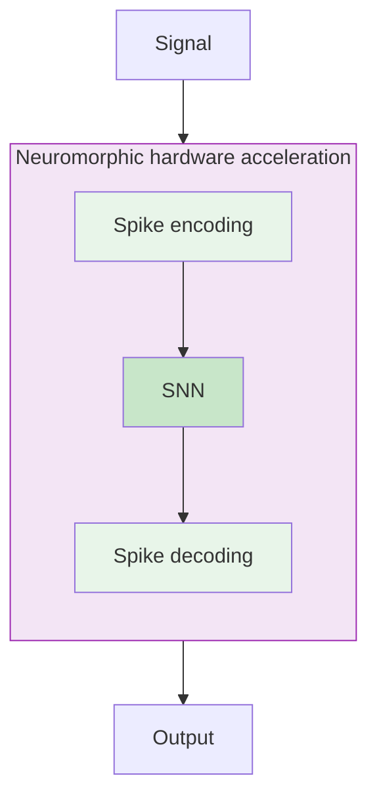

# Brain-inspired event-based signal processing and computing

### From biological inspiration to ultra-low-power hardware

<br/>

**Jens Egholm Pedersen** &middot; jegpe@dtu.dk &middot; jepedersen.dk

Advisor: **Peter Gerstoft** &middot; pegers@dtu.dk

Advanced Topics in Hearing Research &mdash; March 2026

---

# About me

<div>

- Postdoc at **DTU Electro**
- PhD in neurocomputing from **KTH Royal Institute of Technology**, Sweden
- Background in **computer science**, interested in neuromorphic engineering
- Co-founder of **Open Neuromorphic** (open-neuromorphic.org)

<br/>

Research question:

> How can we use the **physics of computation** to process signals efficiently?

</div>

<br/>

<v-clicks>

### Roadmap

1. **Why spikes?** &mdash; the case for event-driven processing
2. **Brain-inspired signal processing** &mdash; from receptive fields to spiking wavelets
3. **Brain-inspired hardware** &mdash; neuromorphic chips at hearing-aid power budgets

</v-clicks>

---
class: text-white
---

# Why am I here?

<div class="absolute inset-0 bg-black -z-2"></div>
<video src="/mouse_cortex.mp4" autoplay loop muted class="absolute inset-0 w-full h-full object-cover opacity-100 -z-1"/>

Nervous systems are **masters at signal processing and cognition**:

<v-clicks>

- Sensory systems (e. g. cochlea) does intelligent processing
- Input/output uses discrete **spikes** to save time and energy
- Everything is plastic &mdash; adapts to changes and learns to improve
- All of this on **micro-watts** budgets

</v-clicks>

<v-click>

My work: building **artificial systems** that follow the same principles

- Event-driven, sparse representations
- Event-driven control and feedback loops
- Ultra-low-power neuromorphic hardware

</v-click>

<p class="text-xs text-gray-100 absolute bottom-4 right-6">Background: Human Brain Project, 2023</p>

---
layout: section
---

# Part I
## Why spikes?
### The case for event-driven signal processing

---

# The energy wall

<div class="grid grid-cols-[2fr_3fr] gap-8 items-center">
<div>

<v-clicks>

- Conventional computing separates memory and computation &mdash; creating an **energy bottleneck**
- Moving data is **10,000&times;** more costly than computing
- AI training costs **double every 6 months**
- We are approaching fundamental physical limits

</v-clicks>

</div>
<div>


<p class="text-xs text-gray-400 text-right">Shankar, Energy Estimates, 2023</p>

</div>
</div>

---

# Biological systems got it right

<div class="grid grid-cols-2 gap-12 mt-4">
<div class="text-center p-4 bg-blue-50 rounded-lg">


**Digital transistors**

$10^{-12}$ Joules/operation

~500 W (GPU)

</div>
<div class="text-center p-4 bg-green-50 rounded-lg">


**Biological neurons**

$10^{-20}$ Jolues/operation

~20 W (brain)

</div>
</div>

<p class="text-center mt-4 text-xl font-bold" v-click>

Biology is at least $10^{8}\times$ more efficient

</p>

---

# Event-driven sensing

<div class="grid grid-cols-2 gap-8 items-center">
<div>

Biological sensors don't sample at a fixed rate &mdash; they produce **events** when thresholds are crossed

<v-clicks>

- Only **changes** are transmitted &mdash; no redundancy
- Sparse, asynchronous, energy-efficient

</v-clicks>

<v-click>

<br/>

The same principle in vision: **event cameras**

- Each pixel independently reports changes
- **Microsecond** temporal resolution
- **120 dB** dynamic range

</v-click>

</div>
<div>


<v-click>

<video src="/westmead_3d_small.mp4" autoplay loop muted controls class="h-50 mx-auto rounded shadow"/>
<p class="text-xs text-gray-400 text-center">Event camera data</p>

</v-click>

</div>
</div>

---
layout: section
---

# Part II
## Covariant signal processing
### From receptive fields to spiking wavelets

---


# What the frog's eye tells the frog's brain

<div class="grid grid-cols-[3fr_1fr] gap-8 items-center">
<div>

Frog eyes are **bug detectors**

<v-clicks>

- Sharp, dark, moving edges
- Independent of luminosity
- This is **not** invariance &mdash; the frog still knows *where* and *when*

</v-clicks>

<div v-click class="mt-2">
<!-- 
```mermaid {scale: 0.5}
graph TD
    subgraph S[" "]
        direction LR
        X["x"] -->|"g"| X2["x'"]
    end
    X -->|"φ"| Y["y"]
    X2 -->|"φ'"| Y
    style S fill:none,stroke:none
``` -->

The frog **needs** to know size, position, speed... We need **covariance**

</div>

</div>
<div>


<p class="text-xs text-gray-400">Lettvin et al., 1959</p>

</div>
</div>

---

# What does "covariant" mean?

<div class="grid grid-cols-2 gap-8 items-center">
<div>

A representation $\phi$ is **covariant** if it transforms **predictably** under input transformations $g$.

<v-click>

$$g \cdot \phi = \phi' \cdot g'$$

</v-click>

<v-click>

**Invariance** discards transformation information.

**Covariance** preserves it &mdash; essential for relational processing.

</v-click>

<v-click>

Example in hearing: a melody shifted in pitch should produce a **predictably shifted** representation &mdash; not be treated as a completely new signal.

</v-click>

</div>
<div>


</div>
</div>

---

# Receptive fields: spatial and temporal

<div class="grid grid-cols-2 gap-8 items-center">
<div>

**Spatial**: Gaussian kernels are covariant to affine transformations &mdash; the natural choice for scale-space analysis.

<v-click>

**Temporal**: use the truncated exponential kernel (causal):

$$
h(t;\, \mu) = \begin{cases} \mu^{-1}\exp(-t/\mu) & t > 0 \\ 0 & t \leq 0 \end{cases}
$$

This is **exactly what a leaky integrator does** &mdash; the same operation as synaptic integration in the auditory brainstem.

</v-click>

</div>
<div>

<video src="/spatial_gaussian_wide.mp4" autoplay loop muted class="h-40 mx-auto rounded"/>
<p class="text-xs text-center text-gray-400">Spatial: wide Gaussian receptive field</p>

<div class="grid grid-cols-2 gap-2 mt-4" v-click>

<video src="/temporal_fast.mp4" autoplay loop muted class="h-30 mx-auto rounded"/>

<video src="/temporal_slow.mp4" autoplay loop muted class="h-30 mx-auto rounded"/>

</div>
<p class="text-xs text-center text-gray-400" v-click>Temporal: fast vs. slow decay</p>

</div>
</div>

---

# Spiking receptive fields

**Key insight**: Leaky integrate-and-fire (LIF) neurons *are* scale covariant

<v-clicks>

- The leaky integrator is the **truncated exponential kernel** implemented in hardware
- Cascading leaky integrators creates **higher-order temporal receptive fields**
- This gives us principled, multi-scale signal processing with spikes

</v-clicks>

<div class="grid grid-cols-2 gap-8 mt-4">
<div>

<video src="/circle_dense_coo.mp4" autoplay loop controls style="max-width: 100%;" v-click></video>
</div>
<div>

<video src="/circle_sparse_coo.mp4" autoplay loop controls style="max-width: 100%;" v-click></video>

</div>
</div>

<p class="text-xs text-right text-gray-400 mt-2">Pedersen, Conradt, & Lindeberg, Nature Communications, 2025</p>

---

<video src="/circle_dense.mp4" autoplay loop controls style="max-width: 100%;"></video>

<video src="/circle_sparse.mp4" autoplay loop controls style="max-width: 100%;" v-click></video>


<p class="text-xs text-right text-gray-400 mt-2">Pedersen, Conradt, & Lindeberg, Nature Communications, 2025</p>

---

# Wavelets: multi-scale signal decomposition

<div class="grid grid-cols-2 gap-8 items-center">
<div>

Wavelets decompose a signal into **time and frequency** simultaneously

<v-clicks>

- Short wavelets capture **fast transients**
- Long wavelets capture **low frequencies**
- Biological sensory systems perform approximately the same decomposition
- Wavelets guarantee **perfect reconstruction** &mdash; trade-off between performance and efficiency

</v-clicks>

</div>
<div>

<!-- TODO: replace with a wavelet scalogram image -->

<p class="text-xs text-center text-gray-400">Spiking wavelet decomposition of a sinusoidal signal</p>

</div>
</div>

<v-click>

<div class="mt-4 p-4 bg-blue-50 rounded-lg text-center">

**Key idea**: we can implement wavelet transforms with **spiking neurons** &mdash; using leaky integrators as physical primitives that digitize the signal

</div>

</v-click>

<p class="text-xs text-right text-gray-400 mt-2">Pedersen, Lindeberg, & Gerstoft, ICASSP, 2026</p>

---

# Covariant processing in the spike domain

<div class="grid grid-cols-2 gap-8 items-center">
<div>

Conventional ML: convert to digital &rarr; **process in signal domain** &rarr; convert to analog

<v-click>

Our approach: **stay in the spike domain**

</v-click>

<v-clicks>

- Spiking representations are **homomorphic** &mdash; operations on spikes correspond to operations on signals
- Convolution, filtering, feature extraction &mdash; all directly on spike trains
- No decode/re-encode overhead
- **Result**: ML systems that operate entirely on neuromorphic hardware &mdash; no GPUs or signal-domain detour needed

</v-clicks>

</div>
<div>

<div class="grid grid-cols-2 gap-4">
<div class="text-center">

**Conventional**

```mermaid {scale: 0.6}
graph TD
    A["Signal"] -->B["Analog-to-digital"] --> HW --> D["Digital-to-analog"] --> E["Output"]
    subgraph HW["GPU hardware acceleration"]
      direction TD
      C["ANN"]
    end
    style B fill:#ffcdd2
    style C fill:#ffcdd2
    style D fill:#ffcdd2
```

</div>
<div class="text-center">

**Ours**



</div>
</div>

</div>
</div>

---
layout: section
---

# Part III
## Hardware deployment
### Neuromorphic chips at hearing-aid power budgets

---

# Neuromorphic hardware landscape

<div>

<v-clicks>

- **Co-locate memory and computation** &mdash; no von Neumann bottleneck
- Computation happens **in the physics** of analog circuits
- Orders of magnitude more efficient than digital processing

</v-clicks>

</div>

<div class="grid grid-cols-4 gap-4 mt-6" v-click>
<div class="text-center p-3 bg-blue-50 rounded-lg">

**Intel Loihi 2**

~1 W

Digital neuromorphic

</div>
<div class="text-center p-3 bg-green-50 rounded-lg">

**BrainChip Akida**

~100 mW

Edge inference

</div>
<div class="text-center p-3 bg-purple-50 rounded-lg">

**SynSense Speck**

~10 mW

Integrated sensor + SNN

</div>
<div class="text-center p-3 bg-orange-50 rounded-lg">

**Innatera T1**

~1 mW

Mixed-signal

</div>
</div>

<v-click>

<div class="mt-6 text-center">

Note: still early; modern mixed-signal systems push below 1mW

</div>

</v-click>

---

# From simulation to silicon

<div class="grid grid-cols-2 gap-8 items-center">
<div>

The problem: **14+ hardware platforms**, each with incompatible programming models

<v-clicks>

- Models trained in software **couldn't be deployed**
- Each chip required models built from scratch
- Results couldn't be reproduced 

</v-clicks>
</div>
<div>

<v-click>

**NIR** (Neuromorphic Intermediate Representation)

</v-click>

<v-clicks>

- Defines computational primitives as **differential equations** (continuous-time computing)
- Hardware vendors implement the same ODEs
- Train anywhere &rarr; send to NIR &rarr; deploy anywhere

</v-clicks>

</div>
</div>

<br/>


<p class="text-xs text-right text-gray-400 mt-2">Pedersen et al., Nature Communications, 2024 &middot; open-neuromorphic.org</p>

---

# Why this matters in practice


<div class="grid grid-cols-3 gap-6 mt-6">
<div class="p-4 bg-blue-50 rounded-lg" v-click>

### Power

Neuromorphic chips operating at 1 mW could run signal processing for **weeks** on a single battery charge

</div>
<div class="p-4 bg-green-50 rounded-lg" v-click>

### Latency

Frame-based DSP introduces **milliseconds** of delay

Event-driven processing: **microsecond** response times

</div>
<div class="p-4 bg-purple-50 rounded-lg" v-click>

### Scalability

Same covariant primitives work across **modalities** in space *and* time: vision, audio, tactile

One framework for many applications

</div>
</div>

---

# Future: on-chip adaptation

<div class="grid grid-cols-2 gap-8 items-center mt-4">
<div>

Current hardware uses **fixed algorithms**

<v-clicks>

- Neuromorphic chips support **on-chip learning**
- What if we continuously adapt to changes?
- No cloud, no retraining, no supervision &mdash; learning **directly in the hardware**

</v-clicks>

</div>
<div>

<v-click>

<div class="p-4 bg-orange-50 rounded-lg">

**Open research questions**

- How do we learn unsupervised?
- How do we learn to not degrade performance?
- How do we balance stability and plasticity?

</div>

</v-click>

</div>
</div>

<div class="bg-green-50 p-4 mt-4 text-center" v-click>
Could enable hardware systems that adapt to changes and improve over time
</div>

---

# Collaboration opportunities

<div class="grid grid-cols-2 gap-12 items-start mt-4">
<div>

### What we bring

<v-clicks>

- **Closed-loop homomorphic processing** &mdash; end-to-end signal processing in the spike domain
- **Covariant wavelet decomposition** on neuromorphic hardware
- Deployment pipeline: simulation &rarr; NIR &rarr; chip
- Access to **neuromorphic hardware** (SpiNNaker2, Speck, Innatera)

</v-clicks>

</div>
<div>

### What we are looking for

<v-clicks>

- **Signal processing problems** to solve on neuromorphic substrates
- Problems suitable for spiking edge-processing
- Auditory models to benchmark against
- Clinical data and real-world constraints (power, latency, form factor)

</v-clicks>

</div>
</div>

<v-click>

<div class="mt-6 p-4 bg-blue-50 rounded-lg text-center">

**Concrete starting points**: Spiking wavelet ADC &middot; Neuromorphic noise reduction benchmark &middot; On-chip auditory scene analysis

</div>

</v-click>

---
class: text-center
---

# Summary &amp; thank you

<div class="grid grid-cols-3 gap-4 mt-4">
<div class="p-3 bg-blue-50 rounded-lg text-left text-sm">

**I. Why spikes?** &mdash; Event-driven processing is sparse, asynchronous, and $10^8$x more efficient.

</div>
<div class="p-3 bg-green-50 rounded-lg text-left text-sm">

**II. Covariant SNNs** &mdash; Spiking wavelets with mathematical guarantees, matching or exceeding ANN performance.

</div>
<div class="p-3 bg-purple-50 rounded-lg text-left text-sm">

**III. Hardware** &mdash; Neuromorphic chips at 1 mW, deployable today via NIR.

</div>
</div>

<br/>

**Jens Egholm Pedersen** &middot; jegpe@dtu.dk &middot; **Peter Gerstoft** &middot; pegers@dtu.dk

<div class="grid grid-cols-2 gap-8 text-left text-sm mx-auto mt-4" style="max-width: 600px;">
<div>

**Papers**

- [Spiking Wavelets (2026)](https://arxiv.org/abs/2602.02020)
- [Spatio-temporal receptive fields (2025)](https://www.nature.com/articles/s41467-025-63493-0)
- [NIR (2024)](https://www.nature.com/articles/s41467-024-52259-9)

</div>
<div>

**Resources**

- [jepedersen.dk](https://jepedersen.dk)
- [open-neuromorphic.org](https://open-neuromorphic.org)
- [snnbook.net](https://snnbook.net)

</div>
</div>

<p class="text-xs mt-4 opacity-50">Support from the Novo Nordisk Foundation (NNF24OC0089302)</p>