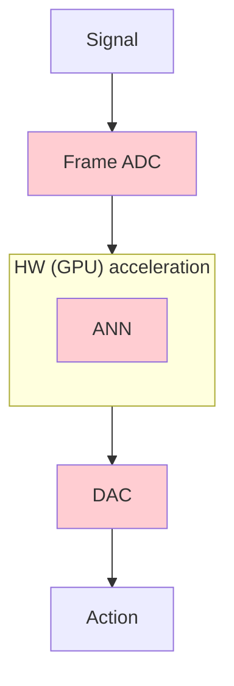
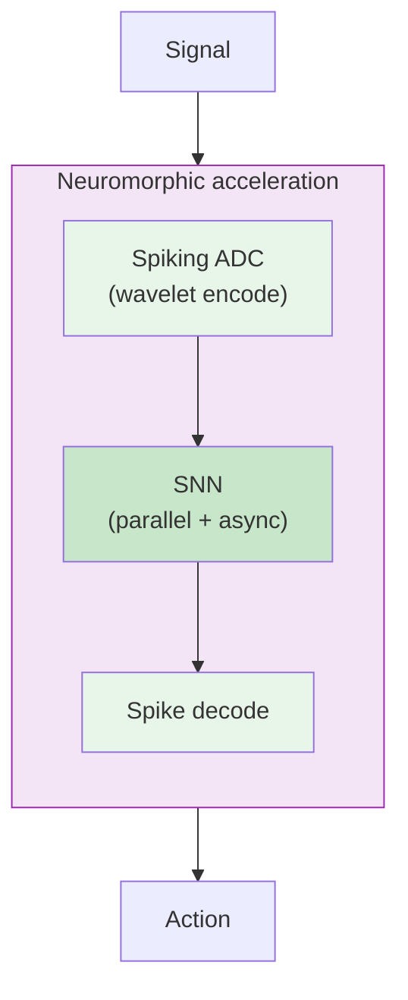

<video autoplay loop muted playsinline class="absolute inset-0 w-full h-full object-cover opacity-80 z-0">
  <source src="/_assets/mouse_cortex.mp4" type="video/mp4"/>
</video>

# Brain-inspired sensing and computing

 

**Jens Egholm Pedersen** &middot; jegpe@dtu.dk &middot; jepedersen.dk

DTU Electro &mdash; Acoustic Technology

 

Presentation day &mdash; June 2026

---

# About me &amp; today's pitch

- Postdoc at **DTU Electro**, advisor **Peter Gerstoft**
- PhD in neurocomputing from **KTH**, MSc in CS from **KU**

 

Today's topic:

> How do we build sensing and signal-processing systems that match the **energy and speed** of biology?

 

<v-clicks>

1. **Why neuromorphic?** &mdash; the energy & time argument, and the pipeline we want
2. **Mixed-signal computers** &mdash; spiking ADC, neuromorphic compute, deployment
3. **Applications** &mdash; ears, eyes, skin, edge logic, general compute

</v-clicks>

From chip to brain &mdash; and back

---
layout: section
---

# Part I
## Why neuromorphic?
### The energy and time argument &mdash; and the pipeline we want

---

# The energy wall

<v-clicks>

- Conventional computing **separates** memory and computation
- Moving data costs **10,000&times;** more energy than computing it
- AI cost **doubles every 2-6 months**
- We are running into fundamental physical limits

</v-clicks>
 
<v-click>

> Up to **27&ndash;35 orders of magnitude** of headroom remain &mdash; if we change the way we compute

</v-click>

Shankar, Energy Estimates, 2023

---

# Biology got it right

**Digital transistors**

$10^{-12}$ J / operation

~500 W (GPU)

**Biological neurons**

$10^{-20}$ J / operation

~20 W (whole brain)

Biology is at least $10^{8}\times$ more energy efficient

<v-click>

Two principles do most of the work: **co-locate memory and compute**, and **only act when something changes**

</v-click>

---

# The pipeline we want

**Today &mdash; signal &rarr; ADC &rarr; GPU &rarr; DAC &rarr; action**

- Every conversion costs **energy and latency**
- Bulk of the power budget is in **moving data**, not computing

**Our pipeline &mdash; stay in the spike domain**

- **Spiking ADC**: sparse, event-driven encode
- **Fully neuromorphic compute**: parallel, asynchronous &mdash; no clock, no global memory bus
- **Spike-domain decode** only when an actuator needs it

End-to-end signal processing that is **sparse** and **asynchronous** &mdash; operations on spikes correspond directly to operations on the signal.

---
layout: section
---

# Part II
## Building the pipeline
### Spiking ADC &middot; neuromorphic compute &middot; deployment

---

# 1. Sensing &mdash; the event camera

Biological sensors don't sample at a fixed rate &mdash; they produce **events** when thresholds are crossed.

<v-clicks>

- Sparse, asynchronous, **no redundant data**
- **Microsecond** temporal resolution
- **120 dB** dynamic range

</v-clicks>

<v-click>

 

Same principle, different modality:
- Vision &rarr; **event cameras**
- Hearing &rarr; **silicon cochleae**, spiking microphones
- Touch &rarr; **event-driven skin** and accelerometers

</v-click>

<v-click>

<video src="/_assets/westmead_3d_small.mp4" autoplay loop muted controls class="h-45 mx-auto rounded shadow"/>

Event camera output (Marcireau, 2023)

</v-click>

---

# 2. Computing &mdash; what von Neumann saw

Von Neumann (1958) already noticed: the nervous system uses **two kinds of signals**

<v-clicks>

- **Analog**: membrane voltages, synaptic currents &mdash; continuous, integrate over time
- **Digital**: spikes are all-or-nothing &mdash; discrete, robust, cheap to transmit
- Memory and computation are **co-located**

</v-clicks>

<v-click>

Neuromorphic systems **combine** continuous (analog) dynamics with discrete (digital) events &mdash; the substrate runs the ODE, the spike is the message.

</v-click>

Abreu &amp; Pedersen, Neuromorphic Computing &amp; Engineering, 2024

---

# 3. Deployment &mdash; let physics do the compute

**14+ neuromorphic platforms** &mdash; each with its own programming model.

<v-clicks>

- **NIR** &mdash; Neuromorphic Intermediate Representation
- Primitives defined as **continuous-time ODEs**
- Train anywhere &rarr; export to NIR &rarr; deploy anywhere
- Vendors: Intel, BrainChip, SynSense, Innatera, SpiNNcloud, Heidelberg

</v-clicks>

Pedersen et al., Nature Communications, 2024

**Intel Loihi 2** &middot; ~1 W

**BrainChip Akida** &middot; ~100 mW

**SynSense Speck** &middot; ~10 mW

**Innatera T1** &middot; ~1 mW

The ODE **is** the chip &mdash; sub-mW for always-on audio

---
layout: section
---

# Part III
## Applications
### Where this matters to you

---

# Sound &mdash; the ear

The cochlea is **already** a spiking, multi-scale wavelet front-end &mdash; nature has done the engineering for us.

<v-clicks>

- **Spiking ADC for audio** &mdash; silicon cochleae
- **Always-on keyword and event detection** at $\mu$W
- **Noise reduction & source separation** with spikes

</v-clicks>

<v-click>

Concrete starting points: a **spiking wavelet ADC** benchmarked against conventional DSP for hearing-aid front-ends &middot; **on-chip auditory scene analysis** for hearables

</v-click>

<v-click>

Pedersen et al. 2026

</v-click>

---

# Beyond hearing &mdash; the same pipeline, other modalities

<v-clicks>

- **Video &mdash; the eyes** &middot; event cameras at 100&ndash;500 mW, $\mu$s latency, 120 dB dynamic range, native input to SNNs. *High-speed tracking, gesture, driver monitoring, drones.*
- **Touch &mdash; tactile & vibration** &middot; event-driven skin and accelerometers; sparse activity ideal for spiking back-ends. *Prosthetics, robotics, predictive maintenance.*
- **Simple logic &mdash; routing / edge** &middot; always-on classifiers, wake-words, anomaly detection, packet routing. *Spiking logic beats clocked microcontrollers when most of the time nothing happens.*
- **General compute** &middot; the same covariant primitives across vision, audio, tactile, control &mdash; one substrate for sensing, signal processing, and classification.

</v-clicks>

<v-click>

**One pipeline** &mdash; event sensor &rarr; spiking ADC &rarr; neuromorphic compute &rarr; spike-domain action &mdash;
**many modalities**, all at $\mu$W&ndash;mW power and $\mu$s latency

</v-click>

---

# Where we are on the computing continuum

**CPU**

Sequential, clocked

~100 W

**GPU / TPU**

Parallel arithmetic

~500 W

**SNNs on GPUs**

Bio-inspired algorithms, conventional HW

**Digital neuromorphic**

Loihi, Akida, SpiNNaker

~1 W

**Analog neuromorphic**

Speck, Innatera, DynapCNN

~1 mW

&larr; von Neumann
Physics-aligned &rarr;

<v-click>

**Direction**: event-driven sensors + neuromorphic compute + embodied agents at biological energy budgets &mdash; **physical AI**

</v-click>

---

# Summary

**Why** &mdash; biology is $10^8\times$ more efficient. Co-locate memory &amp; compute, only act on change.

**Components** &mdash; spiking ADC &rarr; analog+digital neuromorphic compute &rarr; deploy via NIR.

**Applications** &mdash; hearing first, but the same pipeline serves eyes, touch, edge, and general compute at $\mu$W&ndash;mW.

 

**Jens Egholm Pedersen** &middot; jegpe@dtu.dk &middot; jepedersen.dk

**Papers**

- [Spiking Wavelets (2026)](https://arxiv.org/abs/2602.02020)
- [Spatio-temporal receptive fields (2025)](https://www.nature.com/articles/s41467-025-63493-0)
- [NIR (2024)](https://www.nature.com/articles/s41467-024-52259-9)

**Resources**

- [open-neuromorphic.org](https://open-neuromorphic.org)
- [snnbook.net](https://snnbook.net)
- [jepedersen.dk](https://jepedersen.dk)

 

Support from the Novo Nordisk Foundation (NNF24OC0089302)

