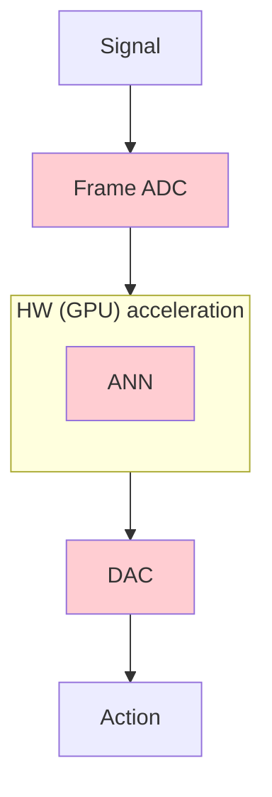
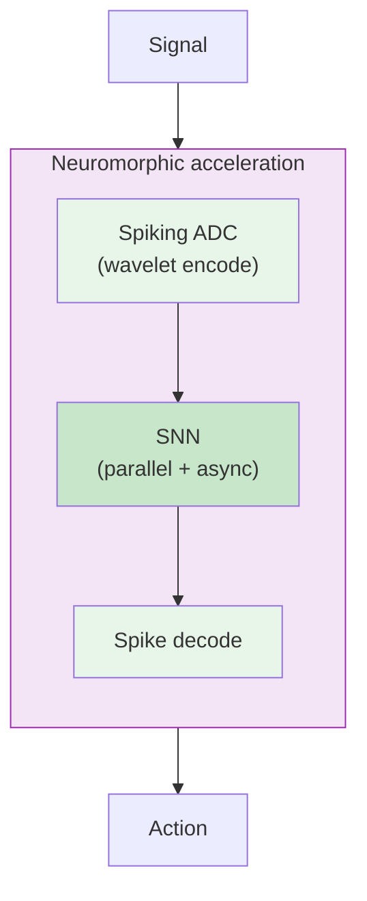

<video autoplay loop muted playsinline class="absolute inset-0 w-full h-full object-cover opacity-60 z-0">
  <source src="/_assets/mouse_cortex.mp4" type="video/mp4"/>
</video>

# Brain-inspired sensing and computing

### A neuromorphic pipeline &mdash; from spiking ADCs to physical AI

 

**Jens Egholm Pedersen** &middot; jegpe@dtu.dk &middot; jepedersen.dk

DTU Electro &mdash; Acoustic Technology

 

Presentation day &mdash; June 2026

---

# About me &amp; today's pitch

- Postdoc at **DTU Electro**, advisor **Peter Gerstoft**
- PhD in neurocomputing from **KTH**, MSc in CS from **KU**

 

Today's topic:

> How do we build sensing and signal-processing systems that match the **energy and speed** of biology?

 

<v-clicks>

1. **Why neuromorphic?** &mdash; the energy & time argument
2. **Models** &mdash; spiking systems for signal processing
3. **Pipeline** &mdash; spiking ADCs + fully neuromorphic compute
4. **Applications** &mdash; ears, eyes, skin, edge logic, general compute

</v-clicks>

An event camera &mdash; a sensor inspired by the retina

---
layout: section
---

# Part I
## Why neuromorphic?
### The energy and time argument

---

# The energy wall

<v-clicks>

- Conventional computing **separates** memory and computation
- Moving data costs **10,000&times;** more energy than computing it
- AI cost **doubles every 2-6 months**
- We are running into fundamental physical limits

</v-clicks>
 
<v-click>

> Up to **27&ndash;35 orders of magnitude** of headroom remain &mdash; if we change the way we compute

</v-click>

Shankar, Energy Estimates, 2023

---

# Biology got it right

**Digital transistors**

$10^{-12}$ J / operation

~500 W (GPU)

**Biological neurons**

$10^{-20}$ J / operation

~20 W (whole brain)

Biology is at least $10^{8}\times$ more energy efficient

<v-click>

Two principles do most of the work: **co-locate memory and compute**, and **only act when something changes**

</v-click>

---

# The time wall: event-driven sensing

Frame-based sensors sample at fixed rates &mdash; biology doesn't

<v-clicks>

- Each "pixel" (or cochlear hair cell) reports **only when it changes**
- **Microsecond** temporal resolution
- **120 dB** dynamic range
- Sparse, asynchronous, **no redundant data**

</v-clicks>

<v-click>

 

The same principle in vision: **event cameras**.
The same principle in hearing: **silicon cochleae** and spiking microphones.

</v-click>

<v-click>

<video src="/_assets/westmead_3d_small.mp4" autoplay loop muted controls class="h-50 mx-auto rounded shadow"/>

Event camera output &mdash; each dot is a brightness change (Marcireau, 2023)

</v-click>

---
layout: section
---

# Part II
## Computational models
### Spiking systems for signal processing

---

# Neurons are both analog *and* digital

Von Neumann (1958) already noticed: the nervous system uses **two kinds of signals**

<v-clicks>

- **Analog**: membrane voltages, synaptic currents &mdash; continuous, numerical, integrate over time
- **Digital**: spikes are all-or-nothing &mdash; discrete, robust, cheap to transmit
- Memory and computation are **co-located**

</v-clicks>

<v-click>

 

$$\tau \frac{dv}{dt} = -v(t) + I(t), \quad v \geq \theta \Rightarrow \text{spike}$$

The leaky integrator runs the **analog** ODE; the threshold emits the **digital** event.

</v-click>

<v-click>

Neuromorphic systems **combines** continuous (analog) dynamics and discrete (digital) events

</v-click>

Abreu &amp; Pedersen, Neuromorphic Computing &amp; Engineering, 2024

---

# Spiking receptive fields work &mdash; even on sparse data

LIF neurons are **naturally scale-covariant** &mdash; with mathematical guarantees on how they handle transformations in space and time.

<v-clicks>

- Applied to **event camera** data, dense and sparse
- **42.4% improvement** over conventional ANN baselines on event-vision tasks
- Built entirely from **neuromorphic primitives** &mdash; deployable today

</v-clicks>

<v-clicks>
<video src="/_assets/circle_dense_coo.mp4" autoplay loop muted class="rounded h-50"/>
<video src="/_assets/circle_sparse_coo.mp4" autoplay loop muted class="rounded h-50"/>
</v-clicks>

Pedersen, Conradt, &amp; Lindeberg, Nature Communications, 2025

---

# Spiking wavelets: async and sparse signal processing

Wavelets decompose a signal in **time and frequency** simultaneously &mdash; the same trick biological sensory systems use.

<v-clicks>

- **Perfect reconstruction** from wavelet theory
- We can do **rigorous signal processing entirely on neuromorphic substrates** &mdash; not just classification.

</v-clicks>

Pedersen, Lindeberg, &amp; Gerstoft, arXiv:2602.02020, 2026

---
layout: section
---

# Part III
## The pipeline
### Spiking ADCs + fully neuromorphic compute

---

# From a digital detour to a spike-domain pipeline

**Today &mdash; signal &rarr; ADC &rarr; GPU &rarr; DAC &rarr; action**

- Every conversion costs **energy and latency**
- Bulk of the power budget is in **moving data**, not computing

**Our pipeline &mdash; stay in the spike domain**

- **Spiking ADC**: sparse, event-driven encode &mdash; wavelet front-end with reconstruction guarantees
- **Fully neuromorphic compute**: parallel, asynchronous &mdash; no clock, no global memory bus
- **Spike-domain decode** only when an actuator needs it

End-to-end signal processing that is **sparse** and **asynchronous** &mdash; operations on spikes correspond directly to operations on the signal.

---

# One model, many chips: NIR

The problem: **14+ neuromorphic platforms**, each with its own programming model.

<v-clicks>

- **NIR**: Neuromorphic Intermediate Representation
- Primitives defined as **continuous-time ODEs**
- Train anywhere &rarr; export to NIR &rarr; deploy anywhere
- Vendors include Intel, BrainChip, SynSense, Innatera, SpiNNcloud, Heidelberg

</v-clicks>

Pedersen et al., Nature Communications, 2024

---

# What does the hardware look like today?

**Intel Loihi 2**

~1 W

Digital, programmable

**BrainChip Akida**

~100 mW

Edge inference

**SynSense Speck**

~10 mW

Integrated event sensor + SNN

**Innatera T1**

~1 mW

Mixed-signal, audio-focused

<v-click>

mixed-signal designs already push **below 1 mW** for always-on audio &mdash; a hearing-aid power budget

</v-click>

---
layout: section
---

# Part IV
## Applications
### Ears, eyes, skin, edge logic, general compute

---

# Applications &mdash; one pipeline, many modalities

<v-clicks>

- **Sound &mdash; the ear** &middot; spiking wavelet ADCs, silicon cochleae, always-on keyword detection, noise reduction & source separation, auditory scene analysis. *Hearing aids, hearables, condition monitoring, sonar.*
- **Video &mdash; the eyes** &middot; event cameras at 100&ndash;500 mW, $\mu$s latency, 120 dB dynamic range, native input to SNNs. *High-speed tracking, gesture, driver monitoring, drones.*
- **Touch &mdash; tactile & vibration** &middot; event-driven skin and accelerometers, sparse activity ideal for spiking back-ends. *Prosthetics, robotics, predictive maintenance.*
- **Simple logic &mdash; routing / edge** &middot; always-on classifiers, wake-words, anomaly detection, packet routing. *Spiking logic beats clocked microcontrollers when most of the time nothing happens.*
- **General compute** &middot; same covariant primitives across vision, audio, tactile, control &mdash; spiking wavelets give rigorous signal processing on the same substrate as classification.

</v-clicks>

<v-click>

**One pipeline** &mdash; event sensor &rarr; spiking ADC &rarr; neuromorphic compute &rarr; spike-domain action &mdash;
**many modalities**, all at $\mu$W&ndash;mW power and $\mu$s latency

</v-click>

---

# Where this fits in the computing continuum

**CPU**

Sequential, clocked

~100 W

**GPU / TPU**

Parallel arithmetic

~500 W

**SNNs on GPUs**

Bio-inspired algorithms, conventional HW

**Digital neuromorphic**

Loihi, Akida, SpiNNaker

~1 W

**Analog neuromorphic**

Speck, Innatera, DynapCNN

~1 mW

&larr; von Neumann
Physics-aligned &rarr;

<v-click>

**Direction**: event-driven sensors + neuromorphic compute + embodied agents at biological energy budgets &mdash; **physical AI**

</v-click>

---

# Summary

**Why** &mdash; biology is $10^8\times$ more efficient. Co-locate memory &amp; compute, only act on change.

**Models** &mdash; Neurons as spatio-temporal pattern matchers for mixed-signal processing

**Pipeline** &mdash; spiking ADC &rarr; parallel, async neuromorphic compute &rarr; embodied systems for hearing, seeing, sensing, and beyond.

 

**Jens Egholm Pedersen** &middot; jegpe@dtu.dk &middot; jepedersen.dk

**Papers**

- [Spiking Wavelets (2026)](https://arxiv.org/abs/2602.02020)
- [Spatio-temporal receptive fields (2025)](https://www.nature.com/articles/s41467-025-63493-0)
- [NIR (2024)](https://www.nature.com/articles/s41467-024-52259-9)

**Resources**

- [open-neuromorphic.org](https://open-neuromorphic.org)
- [snnbook.net](https://snnbook.net)
- [jepedersen.dk](https://jepedersen.dk)

 

Questions? 🙋

Support from the Novo Nordisk Foundation (NNF24OC0089302)

