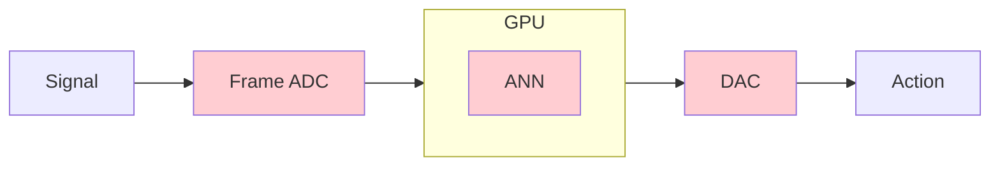
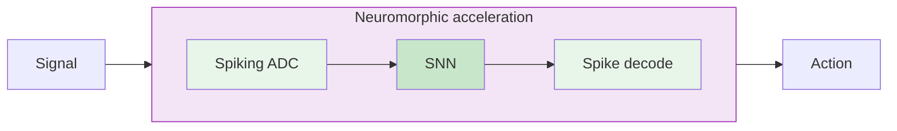

# Frames without frames

## Signal-processing guarantees for event-driven neuromorphic computation

**Jens Egholm Pedersen** &middot; jegpe@dtu.dk &middot; jepedersen.dk

Postdoc, DTU Electro

 

EdgeAI &mdash; *Beyond von Neumann compute* &mdash; September 2026

---

# Wavelet "frame", not video "frame"

A **frame** is a redundant, stable way of representing a signal.

Analysis: $\boldsymbol{T}\colon V \to \ell^2. \qquad \qquad$ Synthesis: $\boldsymbol{T}^\star \colon \ell^2 \to V$

<v-click>

Not a video frame. A guarantee that a (compressed) representation is "meaningful".

</v-click>

<svg viewBox="0 0 420 340" class="w-full max-h-72 mx-auto">
  <rect x="110" y="8" width="200" height="52" rx="8" fill="#eff6ff" stroke="#93c5fd" stroke-width="1.5"/>
  <path d="M 128 38 q 11 -13 22 0 t 22 0 t 22 0 t 22 0 t 22 0 t 22 0 t 22 0" fill="none" stroke="#2563eb" stroke-width="2"/>
  <text x="118" y="26" style="font-size:13px;fill:#1e40af;font-style:italic;">f(t)</text>
  <text x="326" y="40" style="font-size:15px;fill:#64748b;font-style:italic;">V</text>
  <line x1="210" y1="60" x2="210" y2="98" stroke="#475569" stroke-width="1.5" marker-end="url(#ah)"/>
  <text x="218" y="78" style="font-size:13px;fill:#0f172a;font-weight:600;">T</text>
  <text x="230" y="78" style="font-size:10px;fill:#64748b;">analysis</text>
  <rect x="40" y="102" width="340" height="112" rx="8" fill="#f8fafc" stroke="#cbd5e1" stroke-width="1.5"/>
  <line x1="52" y1="158" x2="368" y2="158" stroke="#cbd5e1" stroke-width="1"/>
  <line x1="56" y1="158" x2="56" y2="152" stroke="#475569" stroke-width="1.8"/>
  <circle cx="56" cy="152" r="2.2" fill="#475569"/>
  <line x1="70" y1="158" x2="70" y2="168" stroke="#475569" stroke-width="1.8"/>
  <circle cx="70" cy="168" r="2.2" fill="#475569"/>
  <line x1="84" y1="158" x2="84" y2="136" stroke="#475569" stroke-width="1.8"/>
  <circle cx="84" cy="136" r="2.2" fill="#475569"/>
  <line x1="98" y1="158" x2="98" y2="162" stroke="#475569" stroke-width="1.8"/>
  <circle cx="98" cy="162" r="2.2" fill="#475569"/>
  <line x1="112" y1="158" x2="112" y2="144" stroke="#475569" stroke-width="1.8"/>
  <circle cx="112" cy="144" r="2.2" fill="#475569"/>
  <line x1="126" y1="158" x2="126" y2="186" stroke="#475569" stroke-width="1.8"/>
  <circle cx="126" cy="186" r="2.2" fill="#475569"/>
  <line x1="140" y1="158" x2="140" y2="150" stroke="#475569" stroke-width="1.8"/>
  <circle cx="140" cy="150" r="2.2" fill="#475569"/>
  <line x1="154" y1="158" x2="154" y2="140" stroke="#475569" stroke-width="1.8"/>
  <circle cx="154" cy="140" r="2.2" fill="#475569"/>
  <line x1="168" y1="158" x2="168" y2="170" stroke="#475569" stroke-width="1.8"/>
  <circle cx="168" cy="170" r="2.2" fill="#475569"/>
  <line x1="182" y1="158" x2="182" y2="124" stroke="#475569" stroke-width="1.8"/>
  <circle cx="182" cy="124" r="2.2" fill="#475569"/>
  <line x1="196" y1="158" x2="196" y2="164" stroke="#475569" stroke-width="1.8"/>
  <circle cx="196" cy="164" r="2.2" fill="#475569"/>
  <line x1="210" y1="158" x2="210" y2="148" stroke="#475569" stroke-width="1.8"/>
  <circle cx="210" cy="148" r="2.2" fill="#475569"/>
  <line x1="224" y1="158" x2="224" y2="178" stroke="#475569" stroke-width="1.8"/>
  <circle cx="224" cy="178" r="2.2" fill="#475569"/>
  <line x1="238" y1="158" x2="238" y2="132" stroke="#475569" stroke-width="1.8"/>
  <circle cx="238" cy="132" r="2.2" fill="#475569"/>
  <line x1="252" y1="158" x2="252" y2="166" stroke="#475569" stroke-width="1.8"/>
  <circle cx="252" cy="166" r="2.2" fill="#475569"/>
  <line x1="266" y1="158" x2="266" y2="154" stroke="#475569" stroke-width="1.8"/>
  <circle cx="266" cy="154" r="2.2" fill="#475569"/>
  <line x1="280" y1="158" x2="280" y2="142" stroke="#475569" stroke-width="1.8"/>
  <circle cx="280" cy="142" r="2.2" fill="#475569"/>
  <line x1="294" y1="158" x2="294" y2="172" stroke="#475569" stroke-width="1.8"/>
  <circle cx="294" cy="172" r="2.2" fill="#475569"/>
  <line x1="308" y1="158" x2="308" y2="128" stroke="#475569" stroke-width="1.8"/>
  <circle cx="308" cy="128" r="2.2" fill="#475569"/>
  <line x1="322" y1="158" x2="322" y2="168" stroke="#475569" stroke-width="1.8"/>
  <circle cx="322" cy="168" r="2.2" fill="#475569"/>
  <line x1="336" y1="158" x2="336" y2="152" stroke="#475569" stroke-width="1.8"/>
  <circle cx="336" cy="152" r="2.2" fill="#475569"/>
  <line x1="350" y1="158" x2="350" y2="180" stroke="#475569" stroke-width="1.8"/>
  <circle cx="350" cy="180" r="2.2" fill="#475569"/>
  <line x1="364" y1="158" x2="364" y2="146" stroke="#475569" stroke-width="1.8"/>
  <circle cx="364" cy="146" r="2.2" fill="#475569"/>
  <text x="388" y="164" style="font-size:15px;fill:#64748b;font-style:italic;">&#8467;&#178;</text>
  <text x="210" y="206" style="font-size:10px;fill:#475569;text-anchor:middle;">signed, real-valued, any amplitude</text>
  <line x1="210" y1="214" x2="210" y2="252" stroke="#475569" stroke-width="1.5" marker-end="url(#ah)"/>
  <text x="218" y="232" style="font-size:13px;fill:#0f172a;font-weight:600;">T&#8902;</text>
  <text x="240" y="232" style="font-size:10px;fill:#64748b;">synthesis</text>
  <rect x="110" y="256" width="200" height="52" rx="8" fill="#eff6ff" stroke="#93c5fd" stroke-width="1.5"/>
  <path d="M 128 286 q 11 -13 22 0 t 22 0 t 22 0 t 22 0 t 22 0 t 22 0 t 22 0" fill="none" stroke="#2563eb" stroke-width="2"/>
  <text x="118" y="274" style="font-size:13px;fill:#1e40af;font-style:italic;">&#8776; f(t)</text>
  <text x="326" y="288" style="font-size:15px;fill:#64748b;font-style:italic;">V</text>
  <defs>
    <marker id="ah" viewBox="0 0 10 10" refX="9" refY="5" markerWidth="6" markerHeight="6" orient="auto">
      <path d="M 0 0 L 10 5 L 0 10 z" fill="#475569"/>
    </marker>
  </defs>
</svg>

<svg viewBox="0 0 420 340" class="w-full max-h-72 mx-auto">
  <rect x="110" y="8" width="200" height="52" rx="8" fill="#eff6ff" stroke="#93c5fd" stroke-width="1.5"/>
  <path d="M 128 38 q 11 -13 22 0 t 22 0 t 22 0 t 22 0 t 22 0 t 22 0 t 22 0" fill="none" stroke="#2563eb" stroke-width="2"/>
  <text x="118" y="26" style="font-size:13px;fill:#1e40af;font-style:italic;">f(t)</text>
  <text x="326" y="40" style="font-size:15px;fill:#64748b;font-style:italic;">V</text>
  <line x1="210" y1="60" x2="210" y2="98" stroke="#475569" stroke-width="1.5" marker-end="url(#ah)"/>
  <text x="218" y="78" style="font-size:13px;fill:#0f172a;font-weight:600;">T</text>
  <text x="230" y="78" style="font-size:10px;fill:#64748b;">analysis</text>
  <rect x="40" y="102" width="340" height="112" rx="8" fill="#ecfdf5" stroke="#6ee7b7" stroke-width="1.5"/>
  <rect x="62" y="121" width="2.5" height="11" rx="1" fill="#059669"/>
  <rect x="88" y="121" width="2.5" height="11" rx="1" fill="#059669"/>
  <rect x="104" y="121" width="2.5" height="11" rx="1" fill="#059669"/>
  <rect x="150" y="121" width="2.5" height="11" rx="1" fill="#059669"/>
  <rect x="178" y="121" width="2.5" height="11" rx="1" fill="#059669"/>
  <rect x="214" y="121" width="2.5" height="11" rx="1" fill="#059669"/>
  <rect x="246" y="121" width="2.5" height="11" rx="1" fill="#059669"/>
  <rect x="292" y="121" width="2.5" height="11" rx="1" fill="#059669"/>
  <rect x="318" y="121" width="2.5" height="11" rx="1" fill="#059669"/>
  <rect x="356" y="121" width="2.5" height="11" rx="1" fill="#059669"/>
  <rect x="70" y="141" width="2.5" height="11" rx="1" fill="#059669"/>
  <rect x="96" y="141" width="2.5" height="11" rx="1" fill="#059669"/>
  <rect x="132" y="141" width="2.5" height="11" rx="1" fill="#059669"/>
  <rect x="160" y="141" width="2.5" height="11" rx="1" fill="#059669"/>
  <rect x="196" y="141" width="2.5" height="11" rx="1" fill="#059669"/>
  <rect x="230" y="141" width="2.5" height="11" rx="1" fill="#059669"/>
  <rect x="268" y="141" width="2.5" height="11" rx="1" fill="#059669"/>
  <rect x="300" y="141" width="2.5" height="11" rx="1" fill="#059669"/>
  <rect x="340" y="141" width="2.5" height="11" rx="1" fill="#059669"/>
  <rect x="58" y="161" width="2.5" height="11" rx="1" fill="#059669"/>
  <rect x="84" y="161" width="2.5" height="11" rx="1" fill="#059669"/>
  <rect x="118" y="161" width="2.5" height="11" rx="1" fill="#059669"/>
  <rect x="142" y="161" width="2.5" height="11" rx="1" fill="#059669"/>
  <rect x="186" y="161" width="2.5" height="11" rx="1" fill="#059669"/>
  <rect x="222" y="161" width="2.5" height="11" rx="1" fill="#059669"/>
  <rect x="254" y="161" width="2.5" height="11" rx="1" fill="#059669"/>
  <rect x="288" y="161" width="2.5" height="11" rx="1" fill="#059669"/>
  <rect x="324" y="161" width="2.5" height="11" rx="1" fill="#059669"/>
  <rect x="360" y="161" width="2.5" height="11" rx="1" fill="#059669"/>
  <rect x="76" y="181" width="2.5" height="11" rx="1" fill="#059669"/>
  <rect x="110" y="181" width="2.5" height="11" rx="1" fill="#059669"/>
  <rect x="138" y="181" width="2.5" height="11" rx="1" fill="#059669"/>
  <rect x="172" y="181" width="2.5" height="11" rx="1" fill="#059669"/>
  <rect x="208" y="181" width="2.5" height="11" rx="1" fill="#059669"/>
  <rect x="240" y="181" width="2.5" height="11" rx="1" fill="#059669"/>
  <rect x="276" y="181" width="2.5" height="11" rx="1" fill="#059669"/>
  <rect x="310" y="181" width="2.5" height="11" rx="1" fill="#059669"/>
  <rect x="348" y="181" width="2.5" height="11" rx="1" fill="#059669"/>
  <text x="388" y="164" style="font-size:15px;fill:#64748b;font-style:italic;">&#8467;&#178;</text>
  <text x="210" y="206" style="font-size:10px;fill:#047857;text-anchor:middle;">all-or-nothing spikes, no amplitude</text>
  <line x1="210" y1="214" x2="210" y2="252" stroke="#475569" stroke-width="1.5" marker-end="url(#ah)"/>
  <text x="218" y="232" style="font-size:13px;fill:#0f172a;font-weight:600;">T&#8902;</text>
  <text x="240" y="232" style="font-size:10px;fill:#64748b;">synthesis</text>
  <rect x="110" y="256" width="200" height="52" rx="8" fill="#eff6ff" stroke="#93c5fd" stroke-width="1.5"/>
  <path d="M 128 286 q 11 -13 22 0 t 22 0 t 22 0 t 22 0 t 22 0 t 22 0 t 22 0" fill="none" stroke="#2563eb" stroke-width="2"/>
  <text x="118" y="274" style="font-size:13px;fill:#1e40af;font-style:italic;">&#8776; f(t)</text>
  <text x="326" y="288" style="font-size:15px;fill:#64748b;font-style:italic;">V</text>
  <defs>
    <marker id="ah" viewBox="0 0 10 10" refX="9" refY="5" markerWidth="6" markerHeight="6" orient="auto">
      <path d="M 0 0 L 10 5 L 0 10 z" fill="#475569"/>
    </marker>
  </defs>
</svg>

---

# Neuromorphic computing has existed since the 80's

<v-click>Where is it?</v-click>

<!-- for a real screenshot, replace this inner div with:
      -->

Nature 604, 255&ndash;260 &middot; 2022

Brain-inspired computing needs a master plan

Mehonic &amp; Kenyon

<!-- for a real screenshot, replace this inner div with:
      -->

Proc. IEEE 111(6), 623&ndash;652 &middot; 2023

Bottom-Up and Top-Down Approaches for the Design of Neuromorphic Processing Systems

Frenkel, Bol &amp; Indiveri

<!-- for a real screenshot, replace this inner div with:
      -->

Nature 637, 801&ndash;812 &middot; 2025

Neuromorphic computing at scale

Kudithipudi, Schuman, Vineyard et al.

<!-- for a real screenshot, replace this inner div with:
      -->

Nature Communications 16, 3586 &middot; 2025

The road to commercial success for neuromorphic technologies

Muir &amp; Sheik

<!-- for a real screenshot, replace this inner div with:
      -->

Neuron 113(20), 3311&ndash;3314 &middot; 2025

Neuromorphic is dead. Long live neuromorphic.

Indiveri

<v-click>

We need models and theories that are **co-designed** with hardware.

</v-click>

---

# The argument, in one slide

**Sensors are** (starting to be) **ready**. The **models are built by hand** &mdash; not from theory.

<v-clicks>

1. **The gap** &mdash; the sensors compete, the models on top don't
2. **The promise** &mdash; structure-preserving transformations **in the hardware**
3. **To hardware** &mdash; purely event-driven end to end, compiled

</v-clicks>

<!--
45-60 s. Say "spec" or "contract" out loud here — it is the handle for the rest of the talk.
This slide replaces a separate "what a guarantee buys you" bridge later on.
-->

---
layout: section
---

# Part I
## The gap
### Physical edge intelligence, event-based

---

# The sensors are ready

Each pixel **independently** reports brightness changes.

<v-clicks>

- **Microsecond** temporal resolution
- **120 dB** dynamic range (vs ~60 dB conventional)
- Only changes are transmitted &mdash; no redundancy
- Fundamentally **asynchronous**

</v-clicks>

<v-click>

Same story beyond vision: **always-on keyword spotting**, **wearable ECG**,
**high-speed tracking** &mdash; anywhere the interesting thing is *a change*.

</v-click>

One pixel: an event each time log-luminance crosses a threshold

---

# ...the pipelines are not

We can build the circuits &mdash; but the pipelines that consume them are **built manually**.

<v-clicks>

- Filters chosen **empirically**, tuned per dataset
- No principled answer to whether the spike stream still contains the signal
- No account of what happens when the scene **moves or rescales**
- Present solution: accumulate to frames, and hand it to a GPU

</v-clicks>

<v-click>

**Building frames and handing off to GPUs defeat the point of asynchronous event processing - and ruin the competitive edge**

</v-click>

Abreu &amp; Pedersen, 2024

---
layout: section
---

# Part II
## Two guarantees
### Stable signal recovery &middot; covariance

---

# Guarantee 1 &mdash; the signal survives the spikes

Spiking wavelet frames

<v-click>

**Claim** &mdash; a *frame*: **stably recoverable from spikes**, with bounds.

Leaky integrators all the way down.

</v-click>

<v-click>

**Limit** &mdash; quality **plateaus** with channel count. Spike *counts*, not spike *times* &mdash; yet.

</v-click>

Pedersen, Lindeberg &amp; Gerstoft, arXiv:2602.02020, 2026

<v-click>

The bound says the signal is still there &mdash; **no reason to decode back to check.**

</v-click>

---

# Guarantee 2 &mdash; features survive motion and scale

Covariant spatio-temporal receptive fields

Object approaches &rarr; scale changes &rarr; tuned features degrade &rarr; someone retrains.

<v-click>

**Claim** &mdash; $\phi$ is **covariant** if it transforms predictably under $g$:

$$g \cdot \phi = \phi' \cdot g'$$

Invariance discards $g$. Covariance **keeps** it.

</v-click>

<v-click>

LIF neurons are **approximately scale covariant** &mdash; already in the hardware.

Use them as a prior and training improves: **Cohen's _d_ &ge; 1.9** (LI), **&ge; 1.6** (LIF),
under both spatial and temporal scaling.

</v-click>

<v-click>

**Limit** &mdash; exact in continuous time; on hardware it holds across the scales you actually build.

</v-click>

Pedersen, Conradt &amp; Lindeberg, Nature Communications, 2025

<!--
~3.5 min. NO biological-plausibility framing for this room — the frog stays home.
The limit bullet is first on the cut list if running long.

NOTE: the old "42.4% over ANN baselines" line was wrong, and the same error is in
2602_ITU_REAL and 2604_DTU_bioeng. In the paper the 42.4% is the improvement in L2 loss
(1.13 px, spatial scaling) over UNIFORM INITIALISATION of the same model — not over an
ANN baseline. Cohen's d is the effect size the paper actually reports for the RF prior.
-->

---
layout: section
---

# Part III
## To hardware
### What the guarantees buy, and what runs today

---

# End to end, purely event-driven

- **Filter the spikes, and you filter the signal**
- Convolution, filtering, features &mdash; **directly on spike trains**
- No decode / re-encode detour
- **Latency** set by the sensor &middot; **energy** &prop; events, not pixels

**Conventional**

**Ours**

<v-click>

The guarantee is stated in **continuous time**. A GPU has to clock and discretise it &mdash;
reintroducing the very frame we removed. Neuromorphic hardware **runs ODEs in parallel**.

</v-click>

---

# From model to FPGA, through NIR

Neuromorphic Intermediate Representation (NIR)

Unifies deployment of models across **14+ platforms**

<v-clicks>

- **NIR** defines primitives as **continuous-time ODEs**
- Vendors implement the same ODEs &mdash; train anywhere &rarr; NIR &rarr; deploy anywhere
- Intel, SynSense Speck & Xylo, SpiNNaker2, BrainScaleS, FPGA
- Check out https://synfire.dev

</v-clicks>

<v-click>

**Preliminary &mdash; NIR2FPGA:** Spiking wavelets -> NIR -> FPGA

</v-click>

Pedersen et al., Nature Communications, 2024

Circuit matches the reference. Spiking wavelet on MIT-BIH; event rates in parentheses.

<!--
~2.5 min. This is the slot the industry half can act on — keep it intact when cutting.

FPGA text is drawn from the NIR2FPGA draft (Rontionov, Ayala Le Brun, Beladel, Thomas,
Frenkel, Pedersen). The abstract claims "significant reduction in latency whilst
maintaining higher accuracy" vs Spiker+ but the draft's comparison table still has
unresolved refs — so no hard numbers are quoted here. Check before saying any out loud.

Per-chip power figures were deliberately removed: they aren't measured on a common
workload, a mW ladder implies a ranking that doesn't hold without naming task and
throughput, and some of these vendors are likely in the room. The argument here is
portability, not a chip comparison. If asked for numbers, give them per workload or
not at all.
-->

---

# What it takes to leave the lab

### What we bring

<v-clicks>

- End-to-end signal processing **in the spike domain**, with bounds
- Spiking wavelets as NIR graphs, executable on neuromorphic hardware
  - Algorithm &rarr; NIR &rarr; chip
- Event-based, asynchronous, edge computing

</v-clicks>

### What we are looking for

<v-clicks>

- **Signal-processing problems** with real power, latency and form-factor constraints
- Problems suitable for spiking edge processing
- Benchmarks to be measured against

</v-clicks>

<v-click>

Bring me an always-on sensing problem where **latency or battery is the binding
constraint** &mdash; we will compile it through NIR and tell you what it costs.

</v-click>

<!--
~1.5 min.
-->

---

# Thank you

**Sensors are** (starting to be) **ready**. The **models are built by hand** &mdash; not from theory.

**Jens Egholm Pedersen** &middot; jegpe@dtu.dk &middot; jepedersen.dk

**Papers**

- [Spiking Wavelets (2026)](https://arxiv.org/abs/2602.02020)
- [Spatio-temporal receptive fields (2025)](https://www.nature.com/articles/s41467-025-63493-0)
- [NIR (2024)](https://www.nature.com/articles/s41467-024-52259-9)

**Resources**

- [open-neuromorphic.org](https://open-neuromorphic.org)
- [snnbook.net](https://snnbook.net)
- [jepedersen.dk](https://jepedersen.dk)

 

Support from the Novo Nordisk Foundation (NNF24OC0089302)

---

# Backup &mdash; the energy argument

**Digital transistors**

$10^{-12}$ J / operation

**Biological neurons**

$10^{-20}$ J / operation

$10^{8}\times$ energy

<!--
Deliberately NOT in the main talk — this room has heard the energy-wall slide before,
and it is not what the talk is about. Pull it up only if asked.
-->
