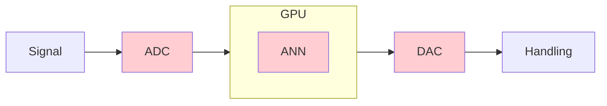
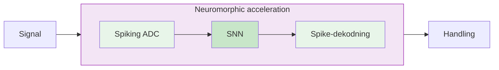

# Mere compute for mindre energi

## Hvordan vi kan gentænke computere

<v-click>

</v-click>

**Jens Egholm Pedersen** &middot; jegpe@dtu.dk &middot; jepedersen.dk

Postdoc, DTU Electro

TechStation TechTalk &mdash; september 2026

---

# Hvorfor mig?

- MSc. i datalogi, KU
- PhD i neuromorphic computing, KTH, Stanford
- Postdoc ved DTU
- Forfatter af Neuromorphic Intermediate Representation, Nature Comms 2024
  - 15+ platforme, flere på vej
- Open-source udvikler med mere end $10^6$ downloads
- Community leder: [open-neuromorphic.org](https://open-neuromorphic.org), [snnbook.net](https://snnbook.net)
- Efterspurgt taler: Zetland, OffDig, KPMG, Dansk IT

---

# Målet: bedre og billigere signal og edge processering

Beregningen kan flytte ind i sensoren

signal- og edge-behandling uden CPU/GPU/TPU

<v-clicks>

1. I dag konverterer vi analoge signaler til digitale, før vi regner &mdash; og **konverteringen er det dyre**
2. I stedet: lad **fysikken regne**, og brug binære events som det eneste digitale
3. Det flytter always-on sensorbehandling fra **mW til &micro;W**

</v-clicks>

<!--
1:30. Model: the "argument in one slide" from 2609_EdgeAI.md. Say the thesis out loud twice.
This is the sentence the whole talk defends and the one you want repeated afterwards, so
write it yourself and keep it short enough to say in one breath.
-->

---

# Hvad I går herfra med

<v-clicks>

- **Hvad det ændrer** &mdash; hvor beregningen flytter hen, og hvad det koster
- **Hvor det kan bruges** &mdash; EKG, lyd, akustiske arrays, vision, tilstandsovervågning
- **Hvad I får ud af det** &mdash; tre konkrete forslag vi kan tage videre

</v-clicks>

  
<v-click>
- Meget af det er sikkert kendt stof - vi vil gerne høre fra jer!
</v-click>

---
layout: section
---

# Del I
## Problemet
### Hvad edge-sensing koster i dag

---

# Sensorerne er klar...

Event sensor: hver pixel rapporterer **lokale** ændringer i lysstyrke.

<v-clicks>

- **Mikrosekunders** tidsopløsning
- **120 dB** dynamikområde (mod ~60 dB konventionelt)
- Kun ændringer sendes &mdash; ingen redundans
- Grundlæggende **asynkront**

</v-clicks>

<v-click>

Samme historie ud over vision: **always-on keyword spotting**, **EKG på kroppen**,
**tracking i høj hastighed** &mdash; overalt hvor det interessante er *en ændring*.

</v-click>

Én pixel: en hændelse hver gang log-luminansen krydser en tærskel

---

<!-- [REUSED] from 2609_EdgeAI.md — '...the pipelines are not' -->

# ...det er pipelinen ikke

Vi kan bygge kredsløbene &mdash; men de pipelines, der bruger dem, er **håndbyggede**.

<v-clicks>

- Filtre valgt **empirisk**, tunet pr. datasæt/problem
- Intet principielt svar på, om output stadig er brugbart
- Intet svar på konsekvenser af **bevægelse eller skalering**
- Nuværende løsning: akkumulér frames, send til en GPU

</v-clicks>

<v-click>

**At bygge frames og sende videre til en GPU underminerer hele pointen med asynkron hændelsesbehandling &mdash; det ødelægger konkurrencefordelen**

</v-click>

Abreu &amp; Pedersen, 2024

---

# Hvad omvejen faktisk koster

Vi konverterer verden til tal, flytter tallene til CPU'en, og regner til sidst.
**Udregningerne er billigst.**

<v-clicks>

- **En DRAM-adgang: 1&ndash;2 nJ.** En operation: ~10 pJ
- **ADC'en betaler for stilheden** &mdash; >90% af tiden, i always-on lyd
- **Analogt frontend: 9,3 &micro;W** keyword spotter Kim et al., JSSC 2022

</v-clicks>

Shankar, Energy Estimates, 2023

<!--
- DRAM gap is 2OOM, a programmable core 70 pJ/instruction
- Liu talk at DTU

Not found: end-to-end comparison of conventional vs. event-driven edge
pipeline -->

---

# Vi ved at hjerner kan løse problemet (1950'erne)

<v-click>Hvor bliver neuromorphic computing af?</v-click>

<!-- for a real screenshot, replace this inner div with:
      -->

Nature 604, 255&ndash;260 &middot; 2022

Brain-inspired computing needs a master plan

Mehonic &amp; Kenyon

<!-- for a real screenshot, replace this inner div with:
      -->

Proc. IEEE 111(6), 623&ndash;652 &middot; 2023

Bottom-Up and Top-Down Approaches for the Design of Neuromorphic Processing Systems

Frenkel, Bol &amp; Indiveri

<!-- for a real screenshot, replace this inner div with:
      -->

Nature 637, 801&ndash;812 &middot; 2025

Neuromorphic computing at scale

Kudithipudi, Schuman, Vineyard et al.

<!-- for a real screenshot, replace this inner div with:
      -->

Nature Communications 16, 3586 &middot; 2025

The road to commercial success for neuromorphic technologies

Muir &amp; Sheik

<!-- for a real screenshot, replace this inner div with:
      -->

Neuron 113(20), 3311&ndash;3314 &middot; 2025

Neuromorphic is dead. Long live neuromorphic.

Indiveri

<v-click>

Hardwaren er der. Vi mangler modeller, der er co-designet med hardwaren.

<!--
BRO til næste slide, sig den højt: "det her har været lovet i 40 år — forskellen nu er,
at man kan købe hardwaren." Uden den bro lyder denne slide (hvor blev det af?) og den
næste (her er fem firmaer, der leverer) som to modstridende holdninger.
Punchlinen er ændret 2026-09-24 fra "vi mangler modeller og teori co-designet med
hardwaren" — det var en forskerkonklusion; den nye peger på hullet, DU udfylder.
-->

</v-click>

---

# Hvem leverer i dag

<v-clicks>

- **Intel Hala Point** &mdash; 1,15 mia. neuroner, på størrelse med en mikroovn
- **SpiNNcloud** &mdash; Dresden, europæisk, kommercielt
- **SynSense &middot; Innatera &middot; Prophesee** &mdash; komponenter man kan bestille i dag

</v-clicks>

Prophesee EVK4 &mdash; et event-kamera, til salg nu

<!--
1:30. Keep it short. It is scaffolding for the ask, not the argument.

Verify every company claim before you say it. Do NOT quote a chip's power number without
naming task and throughput — same caveat as the NIR slide, and some of these vendors'
customers may be in the room.
-->

---
layout: section
---

# Del II
## Argumentet for mixed-signal
### Kontinuert dynamik, diskrete hændelser

---

# To signaler, ét substrat

<v-clicks>

- **Analog tilstand, digitale hændelser** &mdash; tilstanden er kontinuert, kun hændelserne er binære (spikes)
- **Differentialligningen *er* kredsløbet** &mdash; vi simulerer den ikke, fysikken *er* den
- **Altså: ingen frames, intet ur** &mdash; og ingen samplingrate

</v-clicks>

<v-click>

**Neuromorphic assembly.** På en CPU er det nederste lag en instruktion.
Her er det en differentialligning, som kredsløbet adlyder.

</v-click>

Samme graf, kontinuert eller diskret tid &mdash; analog/mixed-signal HW øverst til venstre

<!--
"Neuromorphic assembly" hører HER, ikke på NIR-sliden. Her er påstanden troskab —
det nederste lag er en ODE, som fysikken udfører — og dér er assembly-billedet præcist.
På NIR-sliden er påstanden portabilitet, og dér modsiger assembly pointen (assembly er
per arkitektur). Brug ONNX-analogien dér og assembly-analogien her; bland dem ikke.

Hvis nogen spørger "er det så ikke bare analog computing fra 60'erne?": forskellen er,
at hændelserne er digitale, så tilstanden kan gendannes og sendes videre uden at
akkumulere drift — det er dét, de to signaler køber dig.

2:30. Everything before this was setup; everything after is the payoff. If one slide gets
rehearsed word for word, make it this one.

Say out loud, not on the slide:
- what "entirely in the mixed-signal domain" rules out — no frames, no decode/re-encode,
  no clocked discretisation of a continuous-time spec;
- the objection to pre-empt: analogue is noisy, imprecise, hard to scale. Your answer is
  the two guarantees on the next slides. Promise them here, by name.
-->

---

<!-- [REUSED] from 2609_EdgeAI.md — 'Guarantee 1' -->

# Garantien &mdash; signalet overlever spikes

Spiking wavelet-frames

Et spike har ingen størrelse &mdash; det er der, eller det er der ikke.
**Hvordan ved man så, at signalet stadig er der?**

<v-click>

I dag: afkod og kig. Vi kan i stedet **regne direkte på spikes**.

</v-click>

<v-click>

**Påstand** &mdash; en *frame*: **stabilt rekonstruerbar fra spikes**, med bounds.

Leaky integrators (RC) hele vejen ned.

</v-click>

Pedersen, Lindeberg &amp; Gerstoft, arXiv:2602.02020, 2026

<v-click>

Vi har vist at signalet stadig findes i spikes &mdash; **ingen grund til at dekode tilbage for at tjekke.**

</v-click>

---

# En hændelsesdrevet pipeline

**Konventionelt**

<v-click at="2">

To konverteringer for at træffe én beslutning &mdash; GPU'en venter på en hel frame

</v-click>

**Vores**

<v-click at="4">

**Energien følger hændelserne, ikke pixels** &mdash; sker der ingenting, bruges der ingenting.

**Latensen sættes af sensoren, ikke af en framerate** &mdash; der er ingen frame at vente på.

</v-click>

<!--
Klik-rækkefølge: 1) Konventionelt-grafik  2) hvad omvejen koster  3) Vores-grafik
1) de to grunde  5) kontinuert tid (kan skæres, hvis du er bagud).

Punkterne fra den gamle version, der nu siges i stedet for at stå på sliden:
 - filtrér spikes, og du filtrerer signalet;
 - foldning, filtrering, features direkte på spike-tog;
 - ingen omvej over dekodning og genindkodning.

De to grunde under 4) er Claudes formulering — omskriv dem til dine egne.
-->

---

<!-- [REUSED] from 2609_EdgeAI.md — 'From model to FPGA, through NIR' -->

# Hvad nu, hvis I vælger den forkerte chip?

Feltet er ungt. Leverandørerne skifter. Det er den reelle risiko ved at bygge på det her.

<v-clicks>

- **Byg ikke til én chip &mdash; byg til NIR**
- Tænk **ONNX for neuromorf hardware**: træn ét sted, kør hvor som helst
- **14+ platforme** taler det i dag &mdash; Intel, SynSense, SpiNNaker, BrainScaleS, FPGA, ...

</v-clicks>

<v-click>

Modeller er frit tilgængeligt på **synfire.dev**

</v-click>

Pedersen et al., Nature Communications, 2024

<!--
~2.5 min. This is the slot the industry half can act on — keep it intact when cutting.
-->

---
layout: section
---

# Del III
## Målet
### Hvad der ændrer sig, hvor det kan bruges, hvad det er værd

---

# Hvad det ændrer

### Always-on

I dag vækker sensoren en MCU, som vækker en GPU.

Med et spike-frontend kører detektionen og udregningen **konstant, ved &micro;W**.

### Væk fra skyen

Rådata forlader aldrig enheden.

**Lavere latens, ingen båndbredde** &mdash; og persondata bliver på kroppen.

### Nye markeder

GPU'er kræver store batterier og kører kun kort tid.

Med $\mu W$ kan vi køre i årevis med små batterier.

<v-click>

Beregningen flytter ind i sensoren &mdash; og strømbudgettet er i mindre grad
designbegrænsning.

</v-click>

<!--
2:30. Ask 1 of 3 from your notes: "how it will change the world", excruciatingly specific.
Be concrete and bounded — this room discounts anything that sounds like a manifesto.
-->

---

# Hvor det kan bruges

| **Domæne** | **Begrænsning** | **Hvorfor mixed-signal** | **Status** |
|---|---|---|---|
| Wearables (EKG) | Batteri, båret i dage | Ingen ADC; hændelsesrate = energi | **Kompileret, simuleret** &mdash; næste slide |
| Lyd / høreapparater | mW, always-on | Cochlea-lignende filterbank | Igangværende (DTU) |
| Akustiske arrays | Mange kanaler, ingen netstrøm | Hver kanal er tavs det meste af tiden | Retning &mdash; med Peter Gerstoft |
| Vision / tracking | Latens, &micro;s | Ingen frames, ingen buffer | Publiceret (receptive fields) |
| Tilstandsovervågning | Ingen netstrøm, år på batteri | Kun ændringer koster energi | Åben |

<!--
3:00. Ask 2 of 3: "how it can be applied practically".
-->

---

# Eksempel: EKG på en FPGA

Spiking wavelets &rarr; NIR &rarr; silicium, på MIT-BIH

<v-clicks>

- **Frontend** &mdash; spiking wavelet, ingen ADC
- **Model** &mdash; én NIR-graf, intet håndskrevet
- **Hardware** &mdash; en helt almindelig FPGA &mdash; simuleret, board bring-up er næste skridt

</v-clicks>

<v-click>

352,8 &micro;s

pr. sekund signal **~2800&times; realtid**

Gennemløb; ikke latens fra sensor til handling

</v-click>

<v-click>

$\theta_{\text{thr}}$ afvejer fejl vs hændelsesrate: **energi bliver en designparameter**

</v-click>

Pedersen et al. arXiv, 2026

<!--
2:30. The single most persuasive slide for a founder: it shows the path from idea to part
number. Do not skip it to save time — cut "What you leave with" instead.

LUT/BRAM/DSP er taget AF sliden (siger ikke publikum noget). Tallene, hvis en FPGA-ingeniør
spørger: PYNQ-Z2, 16 bit — 4867 LUT'er, 3 BRAM-tiles, 32 DSP'er; tungere pr. neuron end
MNIST pga. 16-bits aritmetik. Flaskehalsen er de tætte førstelag (Affine 36%, LI 43%).
Simuleret på 10 samples, ikke målt på board — sig det, før nogen spørger.
-->

---

# Samme argument i akustik

Øret har allerede løst det her.

<v-clicks>

- **Cochlea er et spiking wavelet-frontend** &mdash; en filterbank, hvor hårcellerne laver spikes
- **Mest stilhed** &mdash; præcis det regime, hvor hændelsesdrevet vinder
- **Arrays**: mange kanaler, hver mest tavs &mdash; flere kanaler koster kun, når der sker noget

</v-clicks>

Cochlea som filterbank: gammatone-responser, ét filter pr. sted på basilarmembranen

<!--
~1:30.

Name out loud: hearing devices, keyword spotting and wake-up, condition monitoring by acoustic emission, source
localisation, maritime and structural monitoring.
-->

---

# Køb eller byg, i dag

### Kan købes nu

<v-clicks>

- **Sensorer** &mdash; Prophesee, Sony; mikrofoner
- **Chips** &mdash; SynSense Speck & Xylo, Innatera, Loihi 2, FPGA
- **Software** &mdash; NIR, synfire.dev, Norse, snnTorch

</v-clicks>

### Skal stadig bygges

<v-clicks>

- **Det analoge frontend** til den konkrete sensor
- **Benchmarks** &mdash; åbent, aktiv forskning
- **Værktøjskæden** fra NIR til jeres egen silicium

</v-clicks>

<!--
2:00. This is the slide that turns interest into a conversation at the networking session.
The right-hand column is the product spec for the company you want someone to start.
-->

---
layout: section
---

# Del IV
## Hvad så nu?

---

# Tre forslag til at tage det videre

### 1. Finansiér et pilotprojekt

3&ndash;6 måneder: jeres signal &rarr; NIR &rarr; FPGA, med målte tal for energi og latens

### 2. Start virksomheden

Mixed-signal frontends til always-on sensorer.

Jeg går gerne med som **rådgiver eller konsulent**

### 3. Fondesansøgninger

Innovationsfonden, etc.

ErhvervsPhD og projektbevillinger (5-40 mio)

<v-click>

Kom med et always-on problem, hvor **batteri eller latens er den bindende begrænsning**
&mdash; vi kompilerer det gennem NIR og siger, hvad det koster.

</v-click>

<v-click>

Og for en ordens skyld: EKG-resultatet er simuleret, ikke målt på board endnu,
og analog hardware driver og støjer.
Vi har grænser i kontinuert tid, ikke garantier på tværs af proces, spænding og temperatur.

</v-click>

<!--
2:30. Ask 3 of 3: "what it can bring the startup/people". Land all three asks explicitly —
do not leave the room to infer them. Put your contact details on screen while you say it.
-->

---

# Tak

**Beregningen kan flytte ind i sensoren:** billig edge processering, bedre tidsopløsning og bedre privacy.

Hvis i sparer 1000x energi kan i få **1000x flere sensorer** for samme energibudget.

**Jens Egholm Pedersen** &middot; jegpe@dtu.dk &middot; jepedersen.dk

**Artikler**

- [Spiking Wavelets (2026)](https://arxiv.org/abs/2602.02020)
- [Spatio-temporale receptive fields (2025)](https://www.nature.com/articles/s41467-025-63493-0)
- [NIR (2024)](https://www.nature.com/articles/s41467-024-52259-9)

**Ressourcer**

- [open-neuromorphic.org](https://open-neuromorphic.org)
- [snnbook.net](https://snnbook.net)
- [jepedersen.dk](https://jepedersen.dk)

 

Tak til: **Tony Lindeberg** (KTH), **Michail Rontionov** (Southhampton) og **Peter Gerstoft** (DTU Electro)

Støttet af Novo Nordisk Fonden (NNF24OC0089302)

<!--
Slutlinjen er skiftet 2026-09-23. Den gamle ("modellerne er håndbyggede") var EdgeAI-
oplæggets pointe, ikke dette oplægs. Den nye skal spejle åbningen på "Hvad ka' du?" —
sig den med samme ord begge steder, så salen hører det som én sætning, ikke to.

Alternativer, hvis den her ikke sidder:
 - "Signal- og edge-behandling uden en CPU — konverteringen er det dyre, ikke udregningen."
   (tættest på din åbning, men gentager mekanismen frem for konsekvensen)
 - "Kom med et always-on problem, hvor batteri eller latens er den bindende begrænsning."
   (lukker på selve opfordringen — men den står allerede to gange i Del IV)

Say the acknowledgement out loud, do not just leave it on the slide: the receptive-field
and wavelet results are joint work with Tony, the wavelet and acoustics work with Peter.
If Peter is in the room, name him and point — cheap, and it is his result too.
TODO: anyone else? Jörg Conradt is on the Nature Comms 2025 paper; the NIR2FPGA work is
with Rontionov, Ayala Le Brun, Beladel, Thomas and Frenkel.
-->

---

<!-- ===== BACKUP SLIDES — not in the 40 min; pull up on questions ===== -->

<!-- [REUSED] from 2609_EdgeAI.md — energy argument -->

# Backup &mdash; energiargumentet

**Digitale transistorer**

$10^{-12}$ J / operation

**Biologiske neuroner**

$10^{-20}$ J / operation

$10^{8}\times$ energi

<!--
Deliberately NOT in the main talk — this room has heard the energy-wall slide before,
and it is not what the talk is about. Pull it up only if asked.
-->
---

<!-- [REUSED] from 2606_sdu.md — 'The opportunity: unconventional substrates' (energy_limit.png) -->

# Muligheden: "ukonventionelle" substrater

von Neumann-arkitekturer rammer en skaleringsmur.

<v-clicks>

- **Transistorfysik**
- **Neuromorf, hjernelignende**
- **Fotonik & kvante**
- Løftet: størrelsesordener i energi og hastighed

</v-clicks>

Shankar, Energy Estimates, 2023

---

<!-- [REUSED] from 2606_sdu.md — 'The obstacle: the representational gap' -->

# Forhindringen: det repræsentationelle hul

Vores begrebsapparat er bygget til **digitale, clockede von Neumann**-maskiner:

<v-clicks>

- Boolesk logik, RAM-model, tæt matrixmultiplikation
- Beregninger der er **blinde for substratets fysik**
  - **Beregner alle mulige veje**, ignorerer sparsitet, betaler oversættelsen
- Giver **ineffektivitet** og **langsom udbredelse** af nye substrater

</v-clicks>

Tilpasset fra Horsman et al., 2014

---

<!-- [REUSED] from 2606_sdu.md — 'Focus: AI acceleration' (the substrate ladder) -->

# Fokus: AI-acceleration

<v-clicks>

- Energimuren er vores anledning til at skubbe bedre beregningsmodeller for ukonventionelle substrater
- Asynkron, sparsom signalbehandling &rarr; **always-on** edge-AI ved $\mu W–\ mW$
- Hybrid brain–AI / neuromorphic BCI: <a href="https://arxiv.org/abs/2210.01461">Fares, Ronchini, Zamani, Farkhani &amp; Moradi (2022)</a>
</v-clicks>

<b>CPU</b> sekventiel

<b>GPU/TPU</b> tæt aritmetik

<b>SNN på GPU</b> bio-algoritme, vN-hardware

<b>Digital neuromorf</b> ~1 W

<b>Analog / fysik</b>

~$\mu$W - mW

<v-click>

<b>Kvante?</b>  ?

</v-click>

&larr; stort repræsentationelt hul
fysik-tilpasset + sparsomt &rarr;

 
<v-click>

## En trofast compiler &rarr; én beskrivelse, mange substrater

Kudithipudi et al., *Nature*, 2024; Muir & Sheik, *Nature Communication*, 2025;

</v-click>

---

<!-- [REUSED] from 2609_EdgeAI.md — 'Wavelet frame, not video frame' (the frame definition + SVG) -->

# Wavelet-"frame", ikke video-"frame"

En **frame** er en redundant, stabil måde at repræsentere et signal på.

Analysis: $\boldsymbol{T}\colon V \to \ell^2. \qquad \qquad$ Synthesis: $\boldsymbol{T}^\star \colon \ell^2 \to V$

<v-click>

Ikke en videoframe. En garanti for at en (komprimeret) repræsentation er "meningsfuld".

</v-click>

<svg viewBox="0 0 420 340" class="w-full max-h-72 mx-auto">
  <rect x="110" y="8" width="200" height="52" rx="8" fill="#eff6ff" stroke="#93c5fd" stroke-width="1.5"/>
  <path d="M 128 38 q 11 -13 22 0 t 22 0 t 22 0 t 22 0 t 22 0 t 22 0 t 22 0" fill="none" stroke="#2563eb" stroke-width="2"/>
  <text x="118" y="26" style="font-size:13px;fill:#1e40af;font-style:italic;">f(t)</text>
  <text x="326" y="40" style="font-size:15px;fill:#64748b;font-style:italic;">V</text>
  <line x1="210" y1="60" x2="210" y2="98" stroke="#475569" stroke-width="1.5" marker-end="url(#ah)"/>
  <text x="218" y="78" style="font-size:13px;fill:#0f172a;font-weight:600;">T</text>
  <text x="230" y="78" style="font-size:10px;fill:#64748b;">analysis</text>
  <rect x="40" y="102" width="340" height="112" rx="8" fill="#f8fafc" stroke="#cbd5e1" stroke-width="1.5"/>
  <line x1="52" y1="158" x2="368" y2="158" stroke="#cbd5e1" stroke-width="1"/>
  <line x1="56" y1="158" x2="56" y2="152" stroke="#475569" stroke-width="1.8"/>
  <circle cx="56" cy="152" r="2.2" fill="#475569"/>
  <line x1="70" y1="158" x2="70" y2="168" stroke="#475569" stroke-width="1.8"/>
  <circle cx="70" cy="168" r="2.2" fill="#475569"/>
  <line x1="84" y1="158" x2="84" y2="136" stroke="#475569" stroke-width="1.8"/>
  <circle cx="84" cy="136" r="2.2" fill="#475569"/>
  <line x1="98" y1="158" x2="98" y2="162" stroke="#475569" stroke-width="1.8"/>
  <circle cx="98" cy="162" r="2.2" fill="#475569"/>
  <line x1="112" y1="158" x2="112" y2="144" stroke="#475569" stroke-width="1.8"/>
  <circle cx="112" cy="144" r="2.2" fill="#475569"/>
  <line x1="126" y1="158" x2="126" y2="186" stroke="#475569" stroke-width="1.8"/>
  <circle cx="126" cy="186" r="2.2" fill="#475569"/>
  <line x1="140" y1="158" x2="140" y2="150" stroke="#475569" stroke-width="1.8"/>
  <circle cx="140" cy="150" r="2.2" fill="#475569"/>
  <line x1="154" y1="158" x2="154" y2="140" stroke="#475569" stroke-width="1.8"/>
  <circle cx="154" cy="140" r="2.2" fill="#475569"/>
  <line x1="168" y1="158" x2="168" y2="170" stroke="#475569" stroke-width="1.8"/>
  <circle cx="168" cy="170" r="2.2" fill="#475569"/>
  <line x1="182" y1="158" x2="182" y2="124" stroke="#475569" stroke-width="1.8"/>
  <circle cx="182" cy="124" r="2.2" fill="#475569"/>
  <line x1="196" y1="158" x2="196" y2="164" stroke="#475569" stroke-width="1.8"/>
  <circle cx="196" cy="164" r="2.2" fill="#475569"/>
  <line x1="210" y1="158" x2="210" y2="148" stroke="#475569" stroke-width="1.8"/>
  <circle cx="210" cy="148" r="2.2" fill="#475569"/>
  <line x1="224" y1="158" x2="224" y2="178" stroke="#475569" stroke-width="1.8"/>
  <circle cx="224" cy="178" r="2.2" fill="#475569"/>
  <line x1="238" y1="158" x2="238" y2="132" stroke="#475569" stroke-width="1.8"/>
  <circle cx="238" cy="132" r="2.2" fill="#475569"/>
  <line x1="252" y1="158" x2="252" y2="166" stroke="#475569" stroke-width="1.8"/>
  <circle cx="252" cy="166" r="2.2" fill="#475569"/>
  <line x1="266" y1="158" x2="266" y2="154" stroke="#475569" stroke-width="1.8"/>
  <circle cx="266" cy="154" r="2.2" fill="#475569"/>
  <line x1="280" y1="158" x2="280" y2="142" stroke="#475569" stroke-width="1.8"/>
  <circle cx="280" cy="142" r="2.2" fill="#475569"/>
  <line x1="294" y1="158" x2="294" y2="172" stroke="#475569" stroke-width="1.8"/>
  <circle cx="294" cy="172" r="2.2" fill="#475569"/>
  <line x1="308" y1="158" x2="308" y2="128" stroke="#475569" stroke-width="1.8"/>
  <circle cx="308" cy="128" r="2.2" fill="#475569"/>
  <line x1="322" y1="158" x2="322" y2="168" stroke="#475569" stroke-width="1.8"/>
  <circle cx="322" cy="168" r="2.2" fill="#475569"/>
  <line x1="336" y1="158" x2="336" y2="152" stroke="#475569" stroke-width="1.8"/>
  <circle cx="336" cy="152" r="2.2" fill="#475569"/>
  <line x1="350" y1="158" x2="350" y2="180" stroke="#475569" stroke-width="1.8"/>
  <circle cx="350" cy="180" r="2.2" fill="#475569"/>
  <line x1="364" y1="158" x2="364" y2="146" stroke="#475569" stroke-width="1.8"/>
  <circle cx="364" cy="146" r="2.2" fill="#475569"/>
  <text x="388" y="164" style="font-size:15px;fill:#64748b;font-style:italic;">&#8467;&#178;</text>
  <text x="210" y="206" style="font-size:10px;fill:#475569;text-anchor:middle;">signed, real-valued, any amplitude</text>
  <line x1="210" y1="214" x2="210" y2="252" stroke="#475569" stroke-width="1.5" marker-end="url(#ah)"/>
  <text x="218" y="232" style="font-size:13px;fill:#0f172a;font-weight:600;">T&#8902;</text>
  <text x="240" y="232" style="font-size:10px;fill:#64748b;">synthesis</text>
  <rect x="110" y="256" width="200" height="52" rx="8" fill="#eff6ff" stroke="#93c5fd" stroke-width="1.5"/>
  <path d="M 128 286 q 11 -13 22 0 t 22 0 t 22 0 t 22 0 t 22 0 t 22 0 t 22 0" fill="none" stroke="#2563eb" stroke-width="2"/>
  <text x="118" y="274" style="font-size:13px;fill:#1e40af;font-style:italic;">&#8776; f(t)</text>
  <text x="326" y="288" style="font-size:15px;fill:#64748b;font-style:italic;">V</text>
  <defs>
    <marker id="ah" viewBox="0 0 10 10" refX="9" refY="5" markerWidth="6" markerHeight="6" orient="auto">
      <path d="M 0 0 L 10 5 L 0 10 z" fill="#475569"/>
    </marker>
  </defs>
</svg>

<svg viewBox="0 0 420 340" class="w-full max-h-72 mx-auto">
  <rect x="110" y="8" width="200" height="52" rx="8" fill="#eff6ff" stroke="#93c5fd" stroke-width="1.5"/>
  <path d="M 128 38 q 11 -13 22 0 t 22 0 t 22 0 t 22 0 t 22 0 t 22 0 t 22 0" fill="none" stroke="#2563eb" stroke-width="2"/>
  <text x="118" y="26" style="font-size:13px;fill:#1e40af;font-style:italic;">f(t)</text>
  <text x="326" y="40" style="font-size:15px;fill:#64748b;font-style:italic;">V</text>
  <line x1="210" y1="60" x2="210" y2="98" stroke="#475569" stroke-width="1.5" marker-end="url(#ah)"/>
  <text x="218" y="78" style="font-size:13px;fill:#0f172a;font-weight:600;">T</text>
  <text x="230" y="78" style="font-size:10px;fill:#64748b;">analysis</text>
  <rect x="40" y="102" width="340" height="112" rx="8" fill="#ecfdf5" stroke="#6ee7b7" stroke-width="1.5"/>
  <rect x="62" y="121" width="2.5" height="11" rx="1" fill="#059669"/>
  <rect x="88" y="121" width="2.5" height="11" rx="1" fill="#059669"/>
  <rect x="104" y="121" width="2.5" height="11" rx="1" fill="#059669"/>
  <rect x="150" y="121" width="2.5" height="11" rx="1" fill="#059669"/>
  <rect x="178" y="121" width="2.5" height="11" rx="1" fill="#059669"/>
  <rect x="214" y="121" width="2.5" height="11" rx="1" fill="#059669"/>
  <rect x="246" y="121" width="2.5" height="11" rx="1" fill="#059669"/>
  <rect x="292" y="121" width="2.5" height="11" rx="1" fill="#059669"/>
  <rect x="318" y="121" width="2.5" height="11" rx="1" fill="#059669"/>
  <rect x="356" y="121" width="2.5" height="11" rx="1" fill="#059669"/>
  <rect x="70" y="141" width="2.5" height="11" rx="1" fill="#059669"/>
  <rect x="96" y="141" width="2.5" height="11" rx="1" fill="#059669"/>
  <rect x="132" y="141" width="2.5" height="11" rx="1" fill="#059669"/>
  <rect x="160" y="141" width="2.5" height="11" rx="1" fill="#059669"/>
  <rect x="196" y="141" width="2.5" height="11" rx="1" fill="#059669"/>
  <rect x="230" y="141" width="2.5" height="11" rx="1" fill="#059669"/>
  <rect x="268" y="141" width="2.5" height="11" rx="1" fill="#059669"/>
  <rect x="300" y="141" width="2.5" height="11" rx="1" fill="#059669"/>
  <rect x="340" y="141" width="2.5" height="11" rx="1" fill="#059669"/>
  <rect x="58" y="161" width="2.5" height="11" rx="1" fill="#059669"/>
  <rect x="84" y="161" width="2.5" height="11" rx="1" fill="#059669"/>
  <rect x="118" y="161" width="2.5" height="11" rx="1" fill="#059669"/>
  <rect x="142" y="161" width="2.5" height="11" rx="1" fill="#059669"/>
  <rect x="186" y="161" width="2.5" height="11" rx="1" fill="#059669"/>
  <rect x="222" y="161" width="2.5" height="11" rx="1" fill="#059669"/>
  <rect x="254" y="161" width="2.5" height="11" rx="1" fill="#059669"/>
  <rect x="288" y="161" width="2.5" height="11" rx="1" fill="#059669"/>
  <rect x="324" y="161" width="2.5" height="11" rx="1" fill="#059669"/>
  <rect x="360" y="161" width="2.5" height="11" rx="1" fill="#059669"/>
  <rect x="76" y="181" width="2.5" height="11" rx="1" fill="#059669"/>
  <rect x="110" y="181" width="2.5" height="11" rx="1" fill="#059669"/>
  <rect x="138" y="181" width="2.5" height="11" rx="1" fill="#059669"/>
  <rect x="172" y="181" width="2.5" height="11" rx="1" fill="#059669"/>
  <rect x="208" y="181" width="2.5" height="11" rx="1" fill="#059669"/>
  <rect x="240" y="181" width="2.5" height="11" rx="1" fill="#059669"/>
  <rect x="276" y="181" width="2.5" height="11" rx="1" fill="#059669"/>
  <rect x="310" y="181" width="2.5" height="11" rx="1" fill="#059669"/>
  <rect x="348" y="181" width="2.5" height="11" rx="1" fill="#059669"/>
  <text x="388" y="164" style="font-size:15px;fill:#64748b;font-style:italic;">&#8467;&#178;</text>
  <text x="210" y="206" style="font-size:10px;fill:#047857;text-anchor:middle;">all-or-nothing spikes, no amplitude</text>
  <line x1="210" y1="214" x2="210" y2="252" stroke="#475569" stroke-width="1.5" marker-end="url(#ah)"/>
  <text x="218" y="232" style="font-size:13px;fill:#0f172a;font-weight:600;">T&#8902;</text>
  <text x="240" y="232" style="font-size:10px;fill:#64748b;">synthesis</text>
  <rect x="110" y="256" width="200" height="52" rx="8" fill="#eff6ff" stroke="#93c5fd" stroke-width="1.5"/>
  <path d="M 128 286 q 11 -13 22 0 t 22 0 t 22 0 t 22 0 t 22 0 t 22 0 t 22 0" fill="none" stroke="#2563eb" stroke-width="2"/>
  <text x="118" y="274" style="font-size:13px;fill:#1e40af;font-style:italic;">&#8776; f(t)</text>
  <text x="326" y="288" style="font-size:15px;fill:#64748b;font-style:italic;">V</text>
  <defs>
    <marker id="ah" viewBox="0 0 10 10" refX="9" refY="5" markerWidth="6" markerHeight="6" orient="auto">
      <path d="M 0 0 L 10 5 L 0 10 z" fill="#475569"/>
    </marker>
  </defs>
</svg>

---

<!-- [REUSED] from 2609_EdgeAI.md — 'Guarantee 2' -->

# Garanti 2 &mdash; features overlever bevægelse og skala

Kovariante spatio-temporale receptive fields

En detektor trænet på noget i **to meters** afstand holder op med at virke i **fem**.
Objektet er det samme &mdash; det fylder bare noget andet.

<v-click>

Man kan lære modellen at **ignorere** afstanden, eller bygge ind i den,
**hvordan** tingene ændrer sig med afstanden.

Det sidste hedder kovarians: $g \cdot \phi = \phi' \cdot g'$

</v-click>

<v-click>

LIF-neuroner er **tilnærmelsesvis skalakovariante** &mdash; det sidder allerede i hardwaren.

Som prior forbedrer det træningen målbart: **Cohens _d_ &ge; 1,6**.

</v-click>

Pedersen, Conradt &amp; Lindeberg, Nature Communications, 2025

<!--
~3.5 min.
-->

---

# Backup &mdash; NIR2FPGA, tal

Spiking wavelet på MIT-BIH, kompileret gennem NIR til PYNQ-Z2.

$\theta_{\text{thr}}$ sætter afvejningen mellem fejl og hændelsesrate.

Kredsløbet matcher referencen; hændelsesrater i parentes

<!--
Trukket ud af EKG-sliden, så den kunne holdes ren. Læsning:
  θ_thr 0,1 → nRMSE 0,002, hændelsesrate 5,28  |  θ_thr 5,0 → nRMSE 0,559, rate 0,08
  Reference og kredsløb er enige på hver eneste tærskel.
Simuleret, ikke målt på board.
-->
