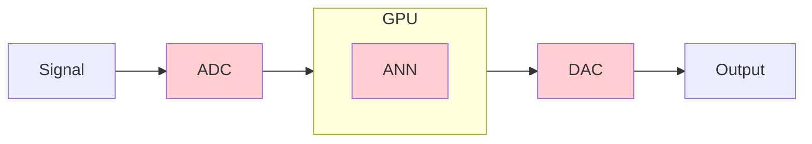
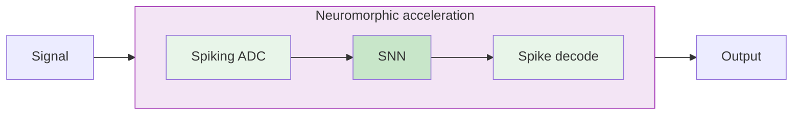

# Structure-preserving receptive fields

## ... unlock microsecond-latency event-based sensory processing

**Jens Egholm Pedersen** &middot; jegpe@dtu.dk &middot; jepedersen.dk

Postdoc, DTU Electro

DTU Space &mdash; *Neuromorphic imaging in space* &mdash; 8 October 2026

---

# What the last two days established

**The sensors fly, and they work**

- ISS: Falcon Neuro / ODIN, Thor-Davis &rarr; DAVIS-LI
- Ground + near-space: BOOTES, Greenland SST, balloons
- Lightning: Spain, Croatia, Säntis, HV lab reconstruction
- Ruggedisation, radiation, qualification: Terma, Coros, ESA

**We hit similar walls downstream**

- Data volume vs. downlink
- Noise filtering chosen per site, per campaign
- &mu;s phenomena, but ms pipelines
- Jetson/GPU in the loop &mdash; SWaP, and a clock

<v-click>

**The sensor is asynchronous and low-powered, but...**

</v-click>

---

# ...the pipelines are not

We can build the circuits &mdash; but the pipelines that consume them are mostly synchronous and hand-tuned.

<v-clicks>

- Filters chosen **empirically**, tuned per dataset
- No principled answer to whether the spike stream still contains the signal
- No account of what happens when the scene **transforms**
- Present solution: accumulate to frames, and hand it to a GPU

</v-clicks>

<v-click>

**Building frames and handing off to GPUs defeat the point of asynchronous event processing - and ruin the competitive edge**

</v-click>

Abreu &amp; Pedersen, 2024

---
layout: section
---

# Part I
## Two guarantees
### Stable recovery &middot; covariance

---

# Guarantee 1 &mdash; the signal survives the spikes

## Wavelet and wavelet bounds

A wavelet atom

$$\psi(t; a, b) = |a|^{-1/2} \, \psi\left((t - b)/a\right)$$

<v-click>

A wavelet transform

$$
\begin{aligned}
\big(T(f)\big)(t; a, b) & = \langle f(t), \psi(t; a, b) \rangle                                                              \\
                        & = \int_{-\infty}^{\infty} f(t) \, |a|^{-1/2} \, \overline{\psi \left((t - b)/a \right)}\ {\rm d}t
\end{aligned}
$$

</v-click>

<v-click>

Frame bounds

$$
A \, \|f\|^2 \leqslant \sum_{k \in K} |\langle f, \psi_k\rangle |^2 \leqslant B \, \|f\|^2
$$

</v-click>

Mallat, <em>A Wavelet Tour of Signal Processing: The Sparse Way</em>, 2009

---

# Guarantee 1 &mdash; the signal survives the spikes

## Scale-parameterized signal representations

Lowpass

$$L(t;\ \sigma) = h(t;\ \sigma) * f(t) = \int_{\xi = -\infty}^{\infty} h(\xi;\ \sigma) \, f(t - \xi) \, {\rm d}\xi$$

$h_{\rm Gauss}(t;\; \sigma) = \frac{1}{\sqrt{2 \pi}\sigma}e^{-\frac{t^2}{2\sigma^2}} \qquad h_{\rm exp}(t;\; \mu) = \begin{cases}
        \mu^{-1} \exp{(-t / \mu)} & t > 0          \\
        0                                             & t \leqslant 0\end{cases}$

<v-click>

Bandpass

$$
\Delta L(t;\; \sigma_k, c) = L(t;\; \sigma_k, c) - L(t;\; \sigma_{k-1}, c) = \psi(t;\; \sigma_k,c) * f(t)
$$

</v-click>

<v-click>

In fact, spikes are a quantized indicator of a scaled representations up to error

$$\epsilon \leqslant C\ \theta_{\rm thr} \Omega,$$

where $\theta_{\rm thr}$ is a threshold, $\Omega$ is the filter bandwidth, $C$ is some constant.

</v-click>

Pedersen et al., <em>Encoding and Decoding Temporal Signals with
Spiking Bandpass Wavelets</em>, 2026

---

# Guarantee 1 &mdash; the signal survives the spikes

## Spiking wavelets

Pedersen et al., <em>Encoding and Decoding Temporal Signals with Spiking Bandpass Wavelets</em>, 2026

---

# Guarantee 2 &mdash; features survive motion and scale

Covariant spatio-temporal receptive fields

Typical processing rely on frames and ANNs

* ANNs ignore crucial temporal structures
* ANNs collapse 

We want **covariance**, not **invariance**.

<v-click>

$$g \cdot \phi = \phi' \cdot g'$$

</v-click>

<v-click>

We prove covariance for affine, Galilean, and temporal scaling

</v-click>

covariant &mdash; keeps g

invariant &mdash; discards g

---

# Guarantee 2 &mdash; features survive motion and scale

Pedersen, Conradt &amp; Lindeberg, Nature Communications, 2025

---

# Guarantee 2 &mdash; features survive motion and scale

TODO &mdash; one line: same scene, same network, the input gets sparser.

  

    <video src="/_assets/circle_dense_coo.mp4" autoplay loop muted playsinline class="absolute inset-0 w-full rounded shadow"/>
    

      <video src="/_assets/circle_sparse_coo.mp4" autoplay loop muted playsinline class="w-full rounded shadow"/>
    

  

  

    
dense

    
sparse &mdash; fewer events

  

  

    <video v-click="1" src="/_assets/circle_dense_predictions.mp4" autoplay loop muted playsinline class="absolute inset-0 w-full rounded shadow"/>
    <video v-click="3" src="/_assets/circle_sparse_predictions.mp4" autoplay loop muted playsinline class="absolute inset-0 w-full rounded shadow bg-white"/>
  

  

    
Events &middot; ANN &middot; LI &middot; LIF &mdash; <b>dense</b> stream

    
Events &middot; ANN &middot; LI &middot; LIF &mdash; <b>sparse</b> stream

  

Pedersen, Conradt &amp; Lindeberg, Nature Communications, 2025

---

# Combined: structure-preserving latent spikes

We suggest to exploit

1) Frame bounds to provide stable **spiking signal representation**
2) **Provable covariance guarantees** to downsample the stream of events

<v-click>

### On FPGA

nRMSE vs. threshold; event rates in parentheses

</v-click>

<v-click >
Note, this is different from (entropy) coding, trained autoencoders, or learned codecs.
</v-click>

---
layout: section
---

# Part II
## Onto hardware
### Compiled, not hand-ported

---

# From model to hardware, through NIR

Neuromorphic Intermediate Representation (NIR)

Unifies deployment of models across **14+ platforms**

<v-clicks>

- **NIR** defines primitives as **continuous-time ODEs**
- Vendors implement the same ODEs
    - Train anywhere &rarr; NIR &rarr; deploy anywhere
- Intel Loihi, SynSense Speck & Xylo, SpiNNaker2, BrainScaleS, FPGA, MLIR, ONNX, ...
- Model zoo at: https://synfire.dev

</v-clicks>

<v-click>

**Preliminary &mdash; NIR2FPGA:** spiking wavelets &rarr; NIR &rarr; FPGA

</v-click>

Pedersen et al., Nature Communications, 2024

---

# 1. Compute before readout &mdash; like a retina

<v-clicks>

- The retina transmits **computed** quantities
- Here, filtering happens **before** the spike
- A "spiking ADC": the conversion **is** the first layer of processing
- The spikes **retain signal structure**

</v-clicks>

**Conventional**

**Ours**

---

# 2. Structured events compress

- We can now do wavelet compression (with spikes)
- The threshold as trade-off, the bound says what you lose
- Covariance guarantees correctness under scene transformation

The dial, measured: rate (in parentheses) against nRMSE

---

# Thank you

### Structure-preserving receptive fields unlock microsecond-latency event-based sensory processing

**Jens Egholm Pedersen** &middot; jegpe@dtu.dk &middot; jepedersen.dk

**Thanks**: Peter Gerstoft (pegers@dtu.dk), Jörg Conradt (conr@kth.se), Tony Lindeberg (KTH), Michail Rontionov (Southhampton)

**Papers**

- [Spiking bandpass wavelets (2026)](https://arxiv.org/abs/2605.09770)
- [Spatio-temporal receptive fields (2025)](https://www.nature.com/articles/s41467-025-63493-0)
- [NIR (2024)](https://www.nature.com/articles/s41467-024-52259-9)

**Resources**

- [open-neuromorphic.org](https://open-neuromorphic.org)
- [snnbook.net](https://snnbook.net)
- [jepedersen.dk](https://jepedersen.dk)

 

Support from the Novo Nordisk Foundation (NNF24OC0089302)

---
layout: section
---

# Backup

---

# Backup &mdash; wavelet "frame", not video "frame"

Analysis: $\boldsymbol{T}\colon V \to \ell^2. \qquad \qquad$ Synthesis: $\boldsymbol{T}^\star \colon \ell^2 \to V$

TODO &mdash; port the full two-state SVG from `2609_EdgeAI.md` (slide 2) if you keep the
terminology in the main line. Otherwise this stays as the one-liner for Q&A.

---

# Backup &mdash; covariance, the limit

- Exact in continuous time; on hardware it holds across the scales you actually build
- The 42.4% figure in older decks is the L2 improvement over **uniform initialisation**,
  not over an ANN baseline &mdash; do not repeat it
- Cohen's *d* is the effect size the paper reports

---

# Backup &mdash; the energy claim in the abstract

The abstract promises *"a fraction of the energy of frame-based solutions"*.
**There is no measured number.** Prepare the answer before someone asks.

TODO &mdash; the claim rests on: the wavelet formalism maps to silicon, and in that
circuit the work done scales with the event rate rather than with the pixel count.
In theory. Write the one-sentence version, and say "in theory" out loud.

- [ ] What would make it measurable: which board, which workload, what you would report
- [ ] What you will NOT claim: joules per inference, or any ratio against a GPU

---

# Backup &mdash; the energy argument

**Digital transistors**

$10^{-12}$ J / operation

**Biological neurons**

$10^{-20}$ J / operation

$10^{8}\times$ energy

---

# Backup &mdash; NIR platform table

